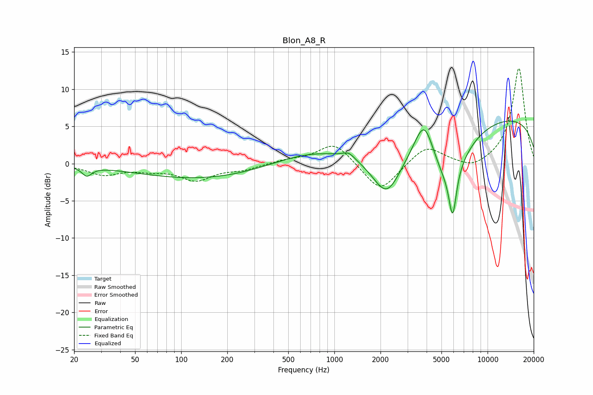

# Blon_A8_R
See [usage instructions](https://github.com/jaakkopasanen/AutoEq#usage) for more options and info.

### Parametric EQs
Apply preamp of -5.8 dB when using parametric equalizer.

|   # | Type    |   Fc (Hz) |    Q |   Gain (dB) |
|-----|---------|-----------|------|-------------|
|   1 | Peaking |        24 | 4.51 |        -1.2 |
|   2 | Peaking |       139 | 0.33 |        -2.1 |
|   3 | Peaking |       679 | 0.55 |         1.6 |
|   4 | Peaking |      1239 | 3.71 |         0.8 |
|   5 | Peaking |      2199 | 1.41 |        -6.7 |
|   6 | Peaking |      3860 | 2.25 |         5.5 |
|   7 | Peaking |      5442 | 1.06 |        -7.6 |
|   8 | Peaking |      5914 | 5.75 |        -6.2 |
|   9 | Peaking |      9782 | 0.18 |         3.9 |
|  10 | Peaking |     10000 | 0.18 |         2.7 |

### Fixed Band EQs
When using fixed band (also called graphic) equalizer, apply preamp of **-12.9 dB** (if available) and set gains manually with these parameters.

|   # | Type    |   Fc (Hz) |    Q |   Gain (dB) |
|-----|---------|-----------|------|-------------|
|   1 | Peaking |        31 | 1.41 |        -1.4 |
|   2 | Peaking |        62 | 1.41 |        -0.7 |
|   3 | Peaking |       125 | 1.41 |        -2.1 |
|   4 | Peaking |       250 | 1.41 |        -0.7 |
|   5 | Peaking |       500 | 1.41 |         0.4 |
|   6 | Peaking |      1000 | 1.41 |         2.9 |
|   7 | Peaking |      2000 | 1.41 |        -4   |
|   8 | Peaking |      4000 | 1.41 |         2.5 |
|   9 | Peaking |      8000 | 1.41 |        -1   |
|  10 | Peaking |     16000 | 1.41 |        12.9 |

### Graphs

