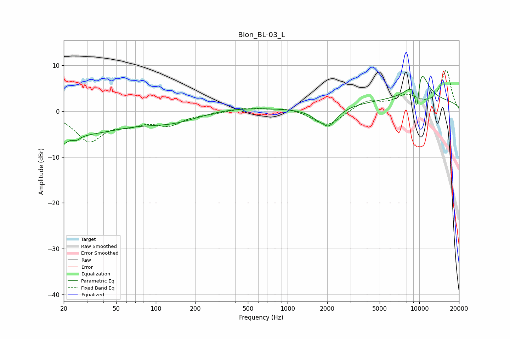

# Blon_BL-03_L
See [usage instructions](https://github.com/jaakkopasanen/AutoEq#usage) for more options and info.

### Parametric EQs
Apply preamp of -7.7 dB when using parametric equalizer.

|   # | Type    |   Fc (Hz) |    Q |   Gain (dB) |
|-----|---------|-----------|------|-------------|
|   1 | Peaking |        20 | 4.64 |        -2.1 |
|   2 | Peaking |        25 | 4.39 |        -1.1 |
|   3 | Peaking |        26 | 0.41 |        -4.8 |
|   4 | Peaking |       138 | 0.62 |        -3.1 |
|   5 | Peaking |       227 | 0.32 |         1.5 |
|   6 | Peaking |      1880 | 4.12 |         1.5 |
|   7 | Peaking |      1956 | 2.13 |        -5.7 |
|   8 | Peaking |      9586 | 6    |        -9.2 |
|   9 | Peaking |     10000 | 0.18 |         2.4 |
|  10 | Peaking |     10000 | 2.18 |         8.9 |

### Fixed Band EQs
When using fixed band (also called graphic) equalizer, apply preamp of **-9.0 dB** (if available) and set gains manually with these parameters.

|   # | Type    |   Fc (Hz) |    Q |   Gain (dB) |
|-----|---------|-----------|------|-------------|
|   1 | Peaking |        31 | 1.41 |        -6.3 |
|   2 | Peaking |        62 | 1.41 |        -2.1 |
|   3 | Peaking |       125 | 1.41 |        -2.7 |
|   4 | Peaking |       250 | 1.41 |        -0.4 |
|   5 | Peaking |       500 | 1.41 |         0.8 |
|   6 | Peaking |      1000 | 1.41 |         0.7 |
|   7 | Peaking |      2000 | 1.41 |        -3.5 |
|   8 | Peaking |      4000 | 1.41 |         2.2 |
|   9 | Peaking |      8000 | 1.41 |         3   |
|  10 | Peaking |     16000 | 1.41 |         8.8 |

### Graphs

