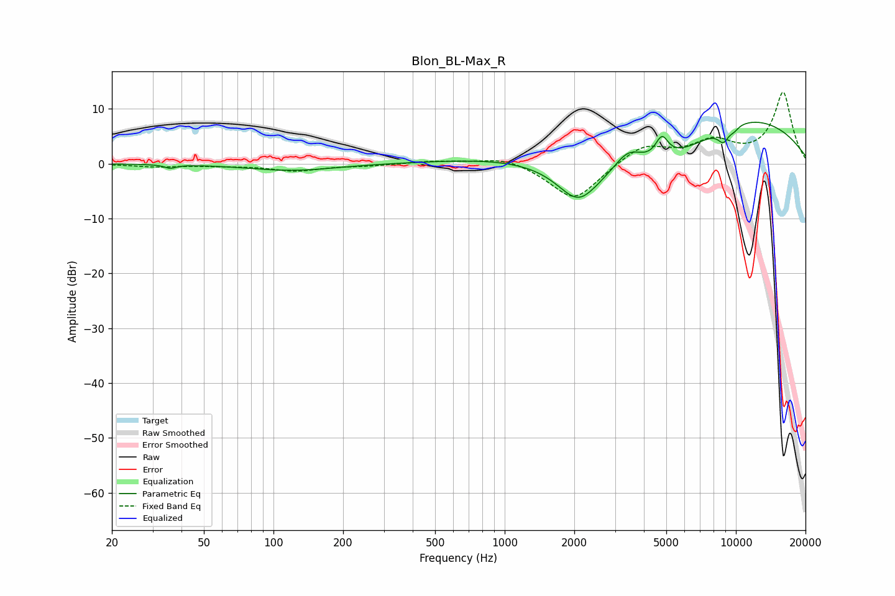

# Blon_BL-Max_R
See [usage instructions](https://github.com/jaakkopasanen/AutoEq#usage) for more options and info.

### Parametric EQs
Apply preamp of -7.6 dB when using parametric equalizer.

|   # | Type    |   Fc (Hz) |    Q |   Gain (dB) |
|-----|---------|-----------|------|-------------|
|   1 | Peaking |        36 | 5.78 |        -0.7 |
|   2 | Peaking |       120 | 0.75 |        -1.3 |
|   3 | Peaking |      1868 | 0.38 |         4   |
|   4 | Peaking |      2077 | 1.58 |        -6.7 |
|   5 | Peaking |      3426 | 2.14 |         4.1 |
|   6 | Peaking |      4194 | 0.37 |       -10   |
|   7 | Peaking |      4788 | 4.98 |         3.9 |
|   8 | Peaking |      8828 | 5.33 |        -2.3 |
|   9 | Peaking |      9619 | 0.35 |        12   |
|  10 | Peaking |      9817 | 6    |        -0.7 |

### Fixed Band EQs
When using fixed band (also called graphic) equalizer, apply preamp of **-13.1 dB** (if available) and set gains manually with these parameters.

|   # | Type    |   Fc (Hz) |    Q |   Gain (dB) |
|-----|---------|-----------|------|-------------|
|   1 | Peaking |        31 | 1.41 |        -0.5 |
|   2 | Peaking |        62 | 1.41 |        -0.3 |
|   3 | Peaking |       125 | 1.41 |        -1.3 |
|   4 | Peaking |       250 | 1.41 |        -0.3 |
|   5 | Peaking |       500 | 1.41 |         0.5 |
|   6 | Peaking |      1000 | 1.41 |         1.4 |
|   7 | Peaking |      2000 | 1.41 |        -6.9 |
|   8 | Peaking |      4000 | 1.41 |         3.5 |
|   9 | Peaking |      8000 | 1.41 |         3.6 |
|  10 | Peaking |     16000 | 1.41 |        12.9 |

### Graphs

