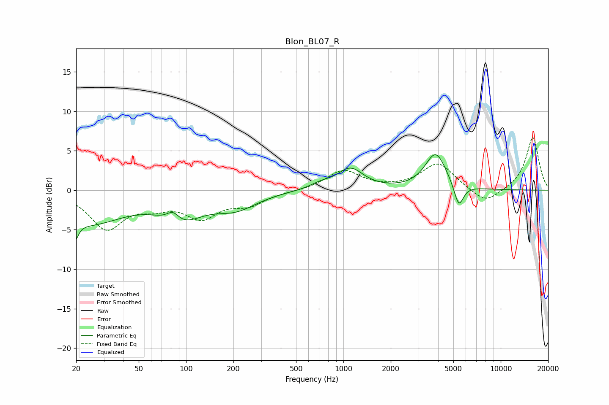

# Blon_BL07_R
See [usage instructions](https://github.com/jaakkopasanen/AutoEq#usage) for more options and info.

### Parametric EQs
Apply preamp of -4.6 dB when using parametric equalizer.

|   # | Type    |   Fc (Hz) |    Q |   Gain (dB) |
|-----|---------|-----------|------|-------------|
|   1 | Peaking |        20 | 5.8  |        -3.9 |
|   2 | Peaking |        20 | 5.99 |         1.8 |
|   3 | Peaking |        24 | 0.62 |        -4   |
|   4 | Peaking |        82 | 3.6  |         1.3 |
|   5 | Peaking |        93 | 1.05 |        -3.2 |
|   6 | Peaking |       207 | 1.04 |        -2   |
|   7 | Peaking |       717 | 2.03 |         0.6 |
|   8 | Peaking |      1107 | 1.72 |         2.6 |
|   9 | Peaking |      3860 | 2.1  |         4.7 |
|  10 | Peaking |      5409 | 4.58 |        -3   |

### Fixed Band EQs
When using fixed band (also called graphic) equalizer, apply preamp of **-6.7 dB** (if available) and set gains manually with these parameters.

|   # | Type    |   Fc (Hz) |    Q |   Gain (dB) |
|-----|---------|-----------|------|-------------|
|   1 | Peaking |        31 | 1.41 |        -4.7 |
|   2 | Peaking |        62 | 1.41 |        -1.5 |
|   3 | Peaking |       125 | 1.41 |        -3.1 |
|   4 | Peaking |       250 | 1.41 |        -1.6 |
|   5 | Peaking |       500 | 1.41 |        -0.1 |
|   6 | Peaking |      1000 | 1.41 |         2.5 |
|   7 | Peaking |      2000 | 1.41 |         0.1 |
|   8 | Peaking |      4000 | 1.41 |         3.4 |
|   9 | Peaking |      8000 | 1.41 |        -1.9 |
|  10 | Peaking |     16000 | 1.41 |         6.7 |

### Graphs

