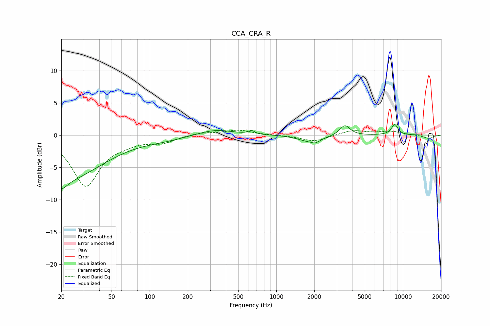

# CCA_CRA_R
See [usage instructions](https://github.com/jaakkopasanen/AutoEq#usage) for more options and info.

### Parametric EQs
Apply preamp of -1.7 dB when using parametric equalizer.

|   # | Type    |   Fc (Hz) |    Q |   Gain (dB) |
|-----|---------|-----------|------|-------------|
|   1 | Peaking |        20 | 3.11 |        -1.6 |
|   2 | Peaking |        22 | 0.48 |        -6.7 |
|   3 | Peaking |       130 | 0.85 |        -0.5 |
|   4 | Peaking |       330 | 1.02 |         0.9 |
|   5 | Peaking |       638 | 5.85 |         0.5 |
|   6 | Peaking |      1881 | 1.82 |        -1.6 |
|   7 | Peaking |      1950 | 2.64 |         1.3 |
|   8 | Peaking |      2015 | 3.62 |        -1   |
|   9 | Peaking |      3480 | 3.56 |         1.6 |
|  10 | Peaking |      8612 | 4.84 |         1.6 |

### Fixed Band EQs
When using fixed band (also called graphic) equalizer, apply preamp of **-0.9 dB** (if available) and set gains manually with these parameters.

|   # | Type    |   Fc (Hz) |    Q |   Gain (dB) |
|-----|---------|-----------|------|-------------|
|   1 | Peaking |        31 | 1.41 |        -7.8 |
|   2 | Peaking |        62 | 1.41 |        -0.8 |
|   3 | Peaking |       125 | 1.41 |        -1   |
|   4 | Peaking |       250 | 1.41 |         0.4 |
|   5 | Peaking |       500 | 1.41 |         0.8 |
|   6 | Peaking |      1000 | 1.41 |        -0   |
|   7 | Peaking |      2000 | 1.41 |        -1   |
|   8 | Peaking |      4000 | 1.41 |         0.8 |
|   9 | Peaking |      8000 | 1.41 |         0.6 |
|  10 | Peaking |     16000 | 1.41 |        -0.5 |

### Graphs

