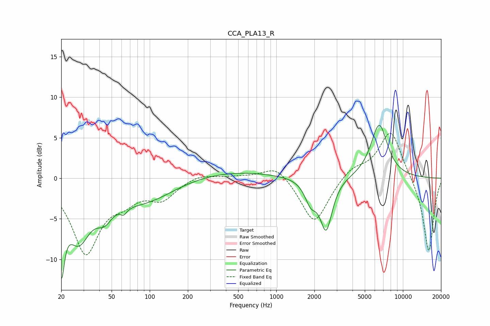

# CCA_PLA13_R
See [usage instructions](https://github.com/jaakkopasanen/AutoEq#usage) for more options and info.

### Parametric EQs
Apply preamp of -6.6 dB when using parametric equalizer.

|   # | Type    |   Fc (Hz) |    Q |   Gain (dB) |
|-----|---------|-----------|------|-------------|
|   1 | Peaking |        20 | 5.71 |        -8.4 |
|   2 | Peaking |        27 | 1.5  |        -6.7 |
|   3 | Peaking |        44 | 2.31 |        -2.2 |
|   4 | Peaking |        63 | 5.78 |        -3.4 |
|   5 | Peaking |        63 | 6    |         2.6 |
|   6 | Peaking |        89 | 0.59 |        -2.8 |
|   7 | Peaking |       412 | 0.38 |         0.9 |
|   8 | Peaking |      1869 | 3.09 |        -2.5 |
|   9 | Peaking |      2476 | 2.96 |        -6.2 |
|  10 | Peaking |      6498 | 2.04 |         6.7 |

### Fixed Band EQs
When using fixed band (also called graphic) equalizer, apply preamp of **-5.6 dB** (if available) and set gains manually with these parameters.

|   # | Type    |   Fc (Hz) |    Q |   Gain (dB) |
|-----|---------|-----------|------|-------------|
|   1 | Peaking |        31 | 1.41 |        -9   |
|   2 | Peaking |        62 | 1.41 |        -1.9 |
|   3 | Peaking |       125 | 1.41 |        -2.3 |
|   4 | Peaking |       250 | 1.41 |         0.6 |
|   5 | Peaking |       500 | 1.41 |         0.2 |
|   6 | Peaking |      1000 | 1.41 |         1.8 |
|   7 | Peaking |      2000 | 1.41 |        -5.7 |
|   8 | Peaking |      4000 | 1.41 |         1.3 |
|   9 | Peaking |      8000 | 1.41 |         6   |
|  10 | Peaking |     16000 | 1.41 |        -9.3 |

### Graphs

