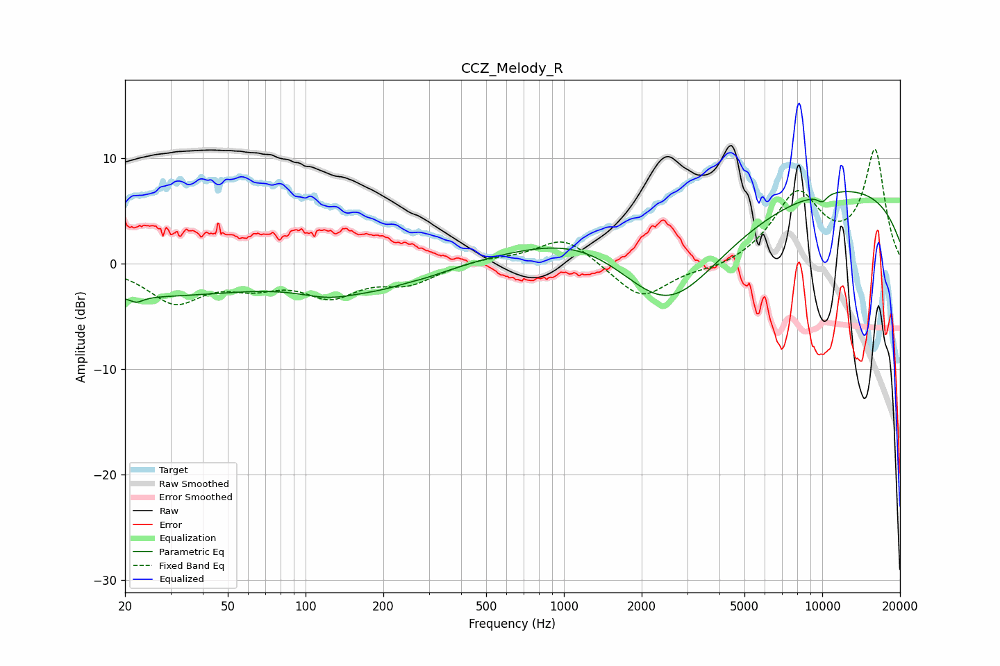

# CCZ_Melody_R
See [usage instructions](https://github.com/jaakkopasanen/AutoEq#usage) for more options and info.

### Parametric EQs
Apply preamp of -6.9 dB when using parametric equalizer.

|   # | Type    |   Fc (Hz) |    Q |   Gain (dB) |
|-----|---------|-----------|------|-------------|
|   1 | Peaking |        20 | 0.25 |        -3.1 |
|   2 | Peaking |        22 | 5.61 |        -0.5 |
|   3 | Peaking |       122 | 1.19 |        -1.2 |
|   4 | Peaking |       176 | 0.75 |        -1.1 |
|   5 | Peaking |       245 | 2.15 |         0.3 |
|   6 | Peaking |       247 | 1.07 |        -1.1 |
|   7 | Peaking |      1292 | 0.53 |         4.2 |
|   8 | Peaking |      2518 | 0.64 |        -9.4 |
|   9 | Peaking |      9999 | 5.98 |        -0.7 |
|  10 | Peaking |     10000 | 0.22 |         7.6 |

### Fixed Band EQs
When using fixed band (also called graphic) equalizer, apply preamp of **-10.9 dB** (if available) and set gains manually with these parameters.

|   # | Type    |   Fc (Hz) |    Q |   Gain (dB) |
|-----|---------|-----------|------|-------------|
|   1 | Peaking |        31 | 1.41 |        -3.5 |
|   2 | Peaking |        62 | 1.41 |        -1.6 |
|   3 | Peaking |       125 | 1.41 |        -2.7 |
|   4 | Peaking |       250 | 1.41 |        -1.7 |
|   5 | Peaking |       500 | 1.41 |         0.4 |
|   6 | Peaking |      1000 | 1.41 |         2.6 |
|   7 | Peaking |      2000 | 1.41 |        -3.4 |
|   8 | Peaking |      4000 | 1.41 |        -0.6 |
|   9 | Peaking |      8000 | 1.41 |         6.4 |
|  10 | Peaking |     16000 | 1.41 |        10.6 |

### Graphs

