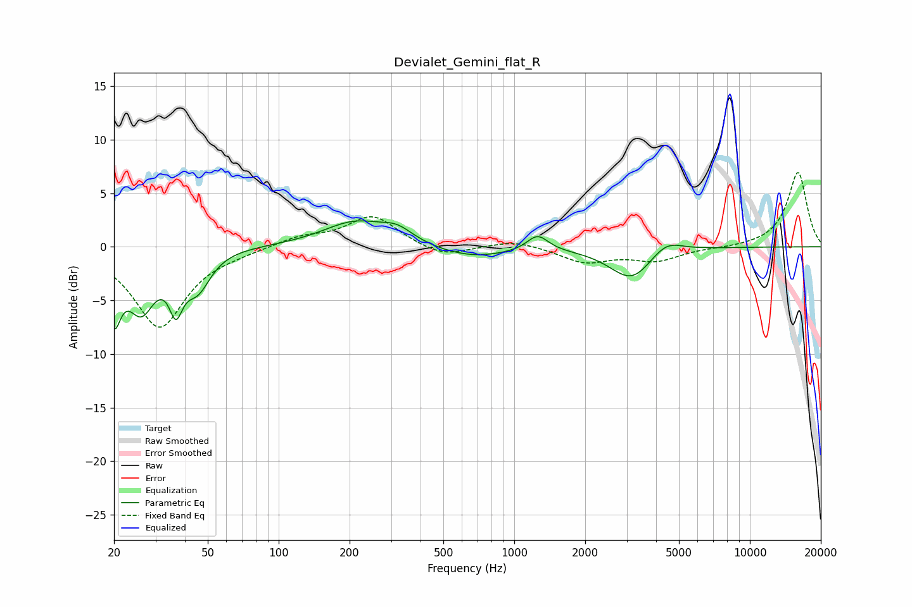

# Devialet_Gemini_flat_R
See [usage instructions](https://github.com/jaakkopasanen/AutoEq#usage) for more options and info.

### Parametric EQs
Apply preamp of -2.5 dB when using parametric equalizer.

|   # | Type    |   Fc (Hz) |    Q |   Gain (dB) |
|-----|---------|-----------|------|-------------|
|   1 | Peaking |        20 | 5    |        -5.4 |
|   2 | Peaking |        26 | 2.42 |        -5.2 |
|   3 | Peaking |        37 | 5.01 |        -3.8 |
|   4 | Peaking |        45 | 2.57 |        -3.3 |
|   5 | Peaking |       211 | 1.03 |         2.3 |
|   6 | Peaking |       319 | 2.11 |         1.1 |
|   7 | Peaking |       655 | 0.88 |        -1.1 |
|   8 | Peaking |      1256 | 3.13 |         1.5 |
|   9 | Peaking |      3155 | 1.53 |        -3.1 |
|  10 | Peaking |      4386 | 2.02 |         1.4 |

### Fixed Band EQs
When using fixed band (also called graphic) equalizer, apply preamp of **-7.0 dB** (if available) and set gains manually with these parameters.

|   # | Type    |   Fc (Hz) |    Q |   Gain (dB) |
|-----|---------|-----------|------|-------------|
|   1 | Peaking |        31 | 1.41 |        -7.5 |
|   2 | Peaking |        62 | 1.41 |        -0.3 |
|   3 | Peaking |       125 | 1.41 |         0.9 |
|   4 | Peaking |       250 | 1.41 |         2.9 |
|   5 | Peaking |       500 | 1.41 |        -1.1 |
|   6 | Peaking |      1000 | 1.41 |         0.7 |
|   7 | Peaking |      2000 | 1.41 |        -1.4 |
|   8 | Peaking |      4000 | 1.41 |        -1.2 |
|   9 | Peaking |      8000 | 1.41 |        -0.1 |
|  10 | Peaking |     16000 | 1.41 |         7   |

### Graphs

