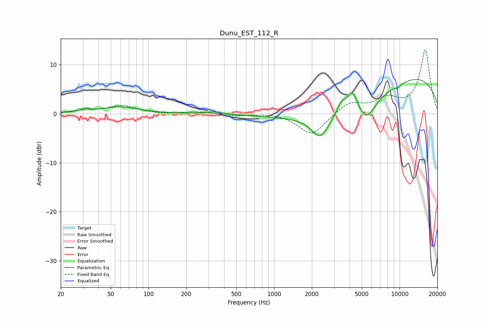

# Dunu_EST_112_R
See [usage instructions](https://github.com/jaakkopasanen/AutoEq#usage) for more options and info.

### Parametric EQs
Apply preamp of -7.1 dB when using parametric equalizer.

|   # | Type    |   Fc (Hz) |    Q |   Gain (dB) |
|-----|---------|-----------|------|-------------|
|   1 | Peaking |        31 | 3.52 |         0.6 |
|   2 | Peaking |        59 | 1.02 |         1.4 |
|   3 | Peaking |       331 | 2.39 |         0.5 |
|   4 | Peaking |      2334 | 2.03 |        -4.7 |
|   5 | Peaking |      3436 | 3.87 |         2.1 |
|   6 | Peaking |      3956 | 0.32 |        -7.2 |
|   7 | Peaking |      4206 | 3.53 |         4   |
|   8 | Peaking |      5473 | 2.02 |        -4.1 |
|   9 | Peaking |      8401 | 0.21 |        10.6 |
|  10 | Peaking |      9737 | 5.78 |        -0.5 |

### Fixed Band EQs
When using fixed band (also called graphic) equalizer, apply preamp of **-13.1 dB** (if available) and set gains manually with these parameters.

|   # | Type    |   Fc (Hz) |    Q |   Gain (dB) |
|-----|---------|-----------|------|-------------|
|   1 | Peaking |        31 | 1.41 |         0.6 |
|   2 | Peaking |        62 | 1.41 |         1.6 |
|   3 | Peaking |       125 | 1.41 |        -0.1 |
|   4 | Peaking |       250 | 1.41 |         0.4 |
|   5 | Peaking |       500 | 1.41 |        -0.4 |
|   6 | Peaking |      1000 | 1.41 |         0.2 |
|   7 | Peaking |      2000 | 1.41 |        -4.4 |
|   8 | Peaking |      4000 | 1.41 |         2.3 |
|   9 | Peaking |      8000 | 1.41 |         2.7 |
|  10 | Peaking |     16000 | 1.41 |        12.9 |

### Graphs

