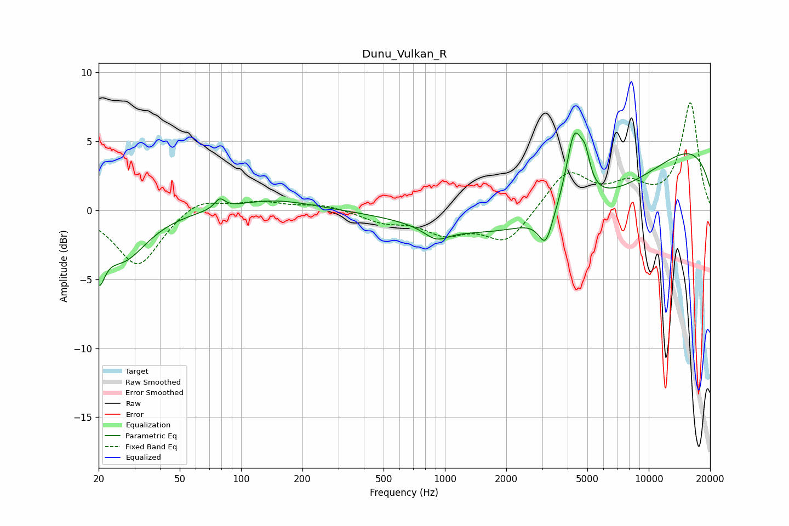

# Dunu_Vulkan_R
See [usage instructions](https://github.com/jaakkopasanen/AutoEq#usage) for more options and info.

### Parametric EQs
Apply preamp of -5.7 dB when using parametric equalizer.

|   # | Type    |   Fc (Hz) |    Q |   Gain (dB) |
|-----|---------|-----------|------|-------------|
|   1 | Peaking |        20 | 4.83 |        -3.1 |
|   2 | Peaking |        26 | 1.21 |        -3.5 |
|   3 | Peaking |        79 | 5.86 |         0.7 |
|   4 | Peaking |       143 | 0.71 |         0.8 |
|   5 | Peaking |       907 | 2.38 |        -0.9 |
|   6 | Peaking |      3121 | 4.15 |        -2.2 |
|   7 | Peaking |      3975 | 0.27 |        -5.9 |
|   8 | Peaking |      4313 | 3.47 |         5.3 |
|   9 | Peaking |      4885 | 5.88 |         1.8 |
|  10 | Peaking |      8884 | 0.18 |         6.6 |

### Fixed Band EQs
When using fixed band (also called graphic) equalizer, apply preamp of **-7.9 dB** (if available) and set gains manually with these parameters.

|   # | Type    |   Fc (Hz) |    Q |   Gain (dB) |
|-----|---------|-----------|------|-------------|
|   1 | Peaking |        31 | 1.41 |        -4.1 |
|   2 | Peaking |        62 | 1.41 |         1   |
|   3 | Peaking |       125 | 1.41 |         0.6 |
|   4 | Peaking |       250 | 1.41 |         0.4 |
|   5 | Peaking |       500 | 1.41 |        -0.8 |
|   6 | Peaking |      1000 | 1.41 |        -1.5 |
|   7 | Peaking |      2000 | 1.41 |        -2.3 |
|   8 | Peaking |      4000 | 1.41 |         2.8 |
|   9 | Peaking |      8000 | 1.41 |         1.6 |
|  10 | Peaking |     16000 | 1.41 |         7.7 |

### Graphs

