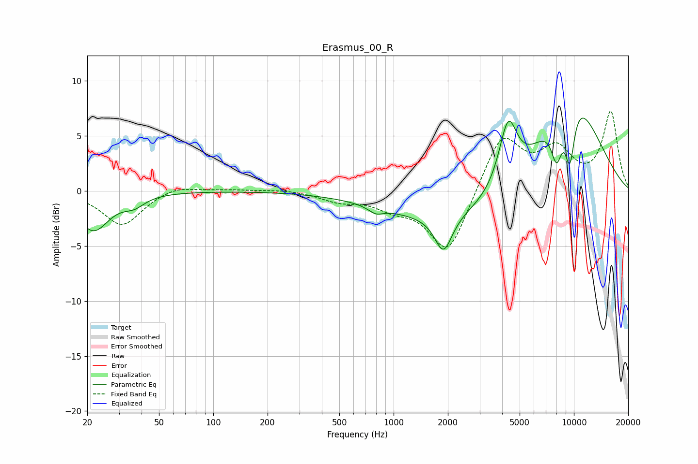

# Erasmus_00_R
See [usage instructions](https://github.com/jaakkopasanen/AutoEq#usage) for more options and info.

### Parametric EQs
Apply preamp of -6.7 dB when using parametric equalizer.

|   # | Type    |   Fc (Hz) |    Q |   Gain (dB) |
|-----|---------|-----------|------|-------------|
|   1 | Peaking |        22 | 1.62 |        -3.5 |
|   2 | Peaking |        36 | 2.44 |        -0.8 |
|   3 | Peaking |       797 | 3.49 |        -0.6 |
|   4 | Peaking |      1891 | 2.98 |        -3.3 |
|   5 | Peaking |      2454 | 0.34 |        -2.9 |
|   6 | Peaking |      4313 | 2.76 |         5.9 |
|   7 | Peaking |      8026 | 3.95 |        -4.2 |
|   8 | Peaking |      9355 | 0.72 |         8.5 |
|   9 | Peaking |      9491 | 4.43 |        -5.4 |
|  10 | Peaking |     10000 | 0.58 |         1.1 |

### Fixed Band EQs
When using fixed band (also called graphic) equalizer, apply preamp of **-7.3 dB** (if available) and set gains manually with these parameters.

|   # | Type    |   Fc (Hz) |    Q |   Gain (dB) |
|-----|---------|-----------|------|-------------|
|   1 | Peaking |        31 | 1.41 |        -3.2 |
|   2 | Peaking |        62 | 1.41 |         0.6 |
|   3 | Peaking |       125 | 1.41 |         0.1 |
|   4 | Peaking |       250 | 1.41 |         0.2 |
|   5 | Peaking |       500 | 1.41 |        -0.8 |
|   6 | Peaking |      1000 | 1.41 |        -1.2 |
|   7 | Peaking |      2000 | 1.41 |        -5.8 |
|   8 | Peaking |      4000 | 1.41 |         5.2 |
|   9 | Peaking |      8000 | 1.41 |         3.4 |
|  10 | Peaking |     16000 | 1.41 |         7.1 |

### Graphs

