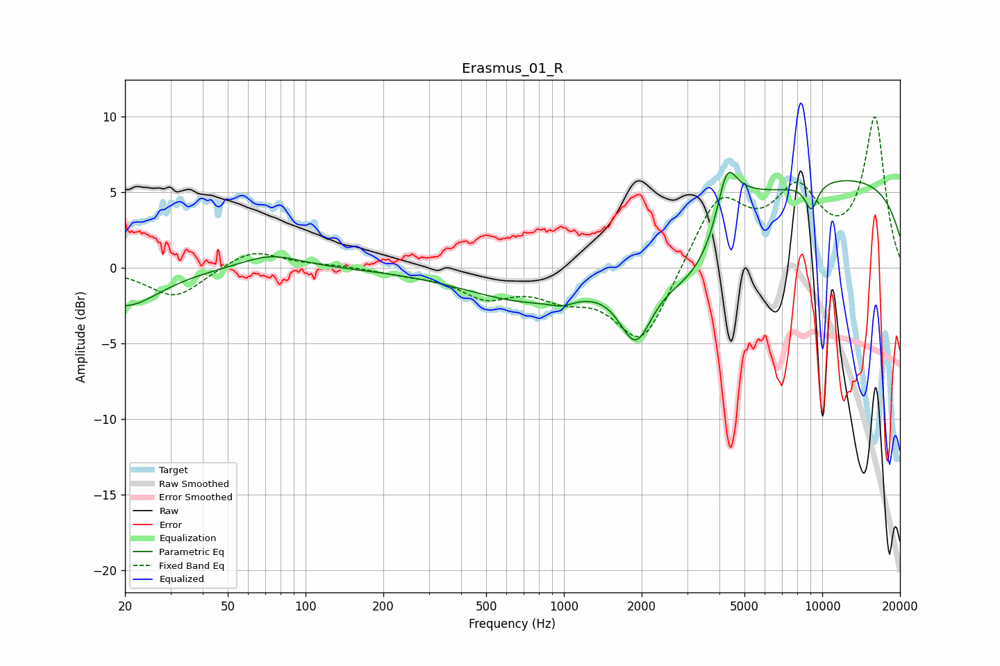

# Erasmus_01_R
See [usage instructions](https://github.com/jaakkopasanen/AutoEq#usage) for more options and info.

### Parametric EQs
Apply preamp of -6.4 dB when using parametric equalizer.

|   # | Type    |   Fc (Hz) |    Q |   Gain (dB) |
|-----|---------|-----------|------|-------------|
|   1 | Peaking |        20 | 1.07 |        -2.6 |
|   2 | Peaking |        73 | 1.2  |         1   |
|   3 | Peaking |       759 | 0.56 |        -2.3 |
|   4 | Peaking |       986 | 3.1  |        -0.4 |
|   5 | Peaking |      1897 | 2.23 |        -4.3 |
|   6 | Peaking |      3456 | 0.81 |        -5.3 |
|   7 | Peaking |      4269 | 3.75 |         3.4 |
|   8 | Peaking |      4646 | 1.3  |         2.9 |
|   9 | Peaking |      9077 | 4.94 |        -1.8 |
|  10 | Peaking |     10000 | 0.19 |         6.1 |

### Fixed Band EQs
When using fixed band (also called graphic) equalizer, apply preamp of **-10.0 dB** (if available) and set gains manually with these parameters.

|   # | Type    |   Fc (Hz) |    Q |   Gain (dB) |
|-----|---------|-----------|------|-------------|
|   1 | Peaking |        31 | 1.41 |        -2   |
|   2 | Peaking |        62 | 1.41 |         1.3 |
|   3 | Peaking |       125 | 1.41 |         0.1 |
|   4 | Peaking |       250 | 1.41 |        -0.3 |
|   5 | Peaking |       500 | 1.41 |        -1.7 |
|   6 | Peaking |      1000 | 1.41 |        -1.5 |
|   7 | Peaking |      2000 | 1.41 |        -5.2 |
|   8 | Peaking |      4000 | 1.41 |         4.7 |
|   9 | Peaking |      8000 | 1.41 |         4.5 |
|  10 | Peaking |     16000 | 1.41 |         9.8 |

### Graphs

