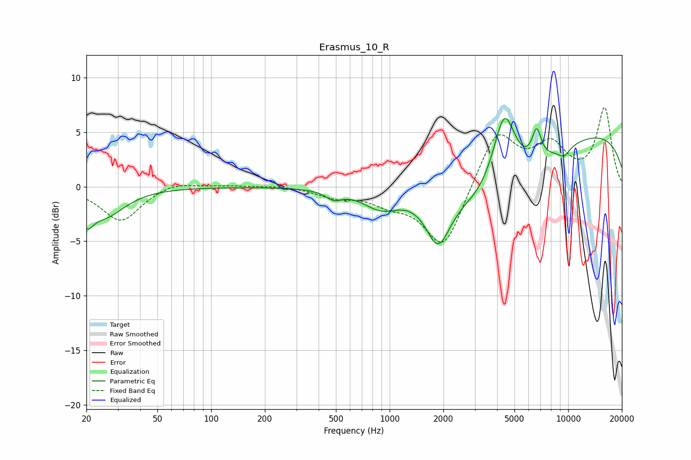

# Erasmus_10_R
See [usage instructions](https://github.com/jaakkopasanen/AutoEq#usage) for more options and info.

### Parametric EQs
Apply preamp of -6.4 dB when using parametric equalizer.

|   # | Type    |   Fc (Hz) |    Q |   Gain (dB) |
|-----|---------|-----------|------|-------------|
|   1 | Peaking |        20 | 3.8  |        -2.1 |
|   2 | Peaking |        26 | 1.28 |        -2.5 |
|   3 | Peaking |       486 | 3.21 |        -0.8 |
|   4 | Peaking |       897 | 1.38 |        -1.8 |
|   5 | Peaking |      1868 | 2.11 |        -4.6 |
|   6 | Peaking |      3965 | 0.55 |        -6.2 |
|   7 | Peaking |      4384 | 2.06 |         7.8 |
|   8 | Peaking |      6662 | 5.15 |         2.8 |
|   9 | Peaking |      9483 | 3.67 |        -0.9 |
|  10 | Peaking |      9751 | 0.18 |         5.4 |

### Fixed Band EQs
When using fixed band (also called graphic) equalizer, apply preamp of **-7.4 dB** (if available) and set gains manually with these parameters.

|   # | Type    |   Fc (Hz) |    Q |   Gain (dB) |
|-----|---------|-----------|------|-------------|
|   1 | Peaking |        31 | 1.41 |        -3.2 |
|   2 | Peaking |        62 | 1.41 |         0.6 |
|   3 | Peaking |       125 | 1.41 |         0.1 |
|   4 | Peaking |       250 | 1.41 |         0.1 |
|   5 | Peaking |       500 | 1.41 |        -0.8 |
|   6 | Peaking |      1000 | 1.41 |        -1.2 |
|   7 | Peaking |      2000 | 1.41 |        -5.8 |
|   8 | Peaking |      4000 | 1.41 |         5.2 |
|   9 | Peaking |      8000 | 1.41 |         3.4 |
|  10 | Peaking |     16000 | 1.41 |         7.1 |

### Graphs

