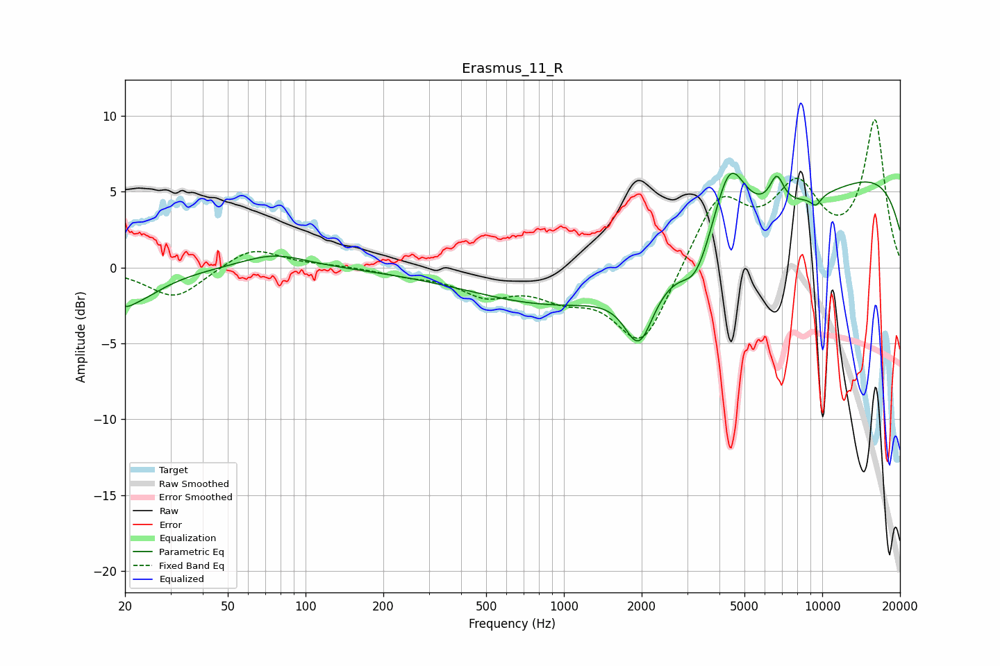

# Erasmus_11_R
See [usage instructions](https://github.com/jaakkopasanen/AutoEq#usage) for more options and info.

### Parametric EQs
Apply preamp of -6.3 dB when using parametric equalizer.

|   # | Type    |   Fc (Hz) |    Q |   Gain (dB) |
|-----|---------|-----------|------|-------------|
|   1 | Peaking |        20 | 5.83 |        -0.2 |
|   2 | Peaking |        20 | 1.18 |        -2.4 |
|   3 | Peaking |        76 | 1.1  |         1   |
|   4 | Peaking |      1954 | 2.53 |        -4   |
|   5 | Peaking |      2809 | 0.18 |        -4.5 |
|   6 | Peaking |      3245 | 2.52 |        -2.3 |
|   7 | Peaking |      4380 | 2.32 |         4.7 |
|   8 | Peaking |      6669 | 4.94 |         1.9 |
|   9 | Peaking |      9451 | 5.92 |        -0.7 |
|  10 | Peaking |      9768 | 0.18 |         7.6 |

### Fixed Band EQs
When using fixed band (also called graphic) equalizer, apply preamp of **-9.8 dB** (if available) and set gains manually with these parameters.

|   # | Type    |   Fc (Hz) |    Q |   Gain (dB) |
|-----|---------|-----------|------|-------------|
|   1 | Peaking |        31 | 1.41 |        -2.1 |
|   2 | Peaking |        62 | 1.41 |         1.4 |
|   3 | Peaking |       125 | 1.41 |         0.1 |
|   4 | Peaking |       250 | 1.41 |        -0.4 |
|   5 | Peaking |       500 | 1.41 |        -1.6 |
|   6 | Peaking |      1000 | 1.41 |        -1.5 |
|   7 | Peaking |      2000 | 1.41 |        -5.3 |
|   8 | Peaking |      4000 | 1.41 |         4.7 |
|   9 | Peaking |      8000 | 1.41 |         4.8 |
|  10 | Peaking |     16000 | 1.41 |         9.5 |

### Graphs

