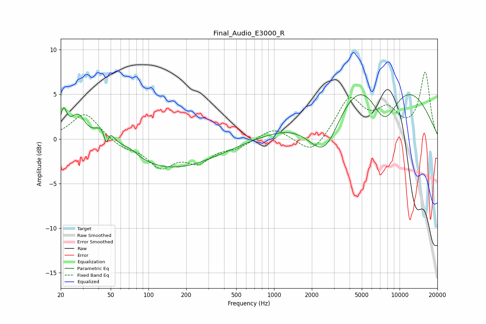

# Final_Audio_E3000_R
See [usage instructions](https://github.com/jaakkopasanen/AutoEq#usage) for more options and info.

### Parametric EQs
Apply preamp of -5.1 dB when using parametric equalizer.

|   # | Type    |   Fc (Hz) |    Q |   Gain (dB) |
|-----|---------|-----------|------|-------------|
|   1 | Peaking |        21 | 5.61 |         2.7 |
|   2 | Peaking |        27 | 2.48 |         2.7 |
|   3 | Peaking |        44 | 2.3  |         1.9 |
|   4 | Peaking |        46 | 6    |        -4.4 |
|   5 | Peaking |        47 | 4.37 |         3.2 |
|   6 | Peaking |        70 | 2    |         0.8 |
|   7 | Peaking |       151 | 0.39 |        -3.3 |
|   8 | Peaking |      2541 | 0.97 |        -7.4 |
|   9 | Peaking |      6128 | 0.32 |        11.7 |
|  10 | Peaking |      7532 | 1    |        -7.9 |

### Fixed Band EQs
When using fixed band (also called graphic) equalizer, apply preamp of **-7.6 dB** (if available) and set gains manually with these parameters.

|   # | Type    |   Fc (Hz) |    Q |   Gain (dB) |
|-----|---------|-----------|------|-------------|
|   1 | Peaking |        31 | 1.41 |         3   |
|   2 | Peaking |        62 | 1.41 |        -0.9 |
|   3 | Peaking |       125 | 1.41 |        -2.9 |
|   4 | Peaking |       250 | 1.41 |        -2.2 |
|   5 | Peaking |       500 | 1.41 |        -0.8 |
|   6 | Peaking |      1000 | 1.41 |         1.3 |
|   7 | Peaking |      2000 | 1.41 |        -1.9 |
|   8 | Peaking |      4000 | 1.41 |         4.4 |
|   9 | Peaking |      8000 | 1.41 |         2.8 |
|  10 | Peaking |     16000 | 1.41 |         7.3 |

### Graphs

