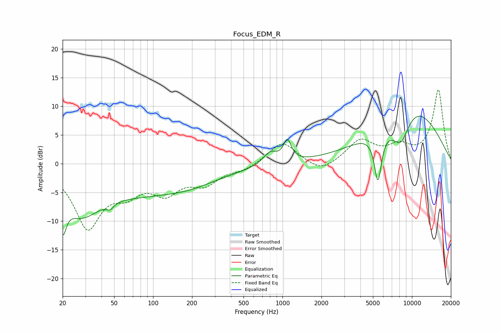

# Focus_EDM_R
See [usage instructions](https://github.com/jaakkopasanen/AutoEq#usage) for more options and info.

### Parametric EQs
Apply preamp of -8.4 dB when using parametric equalizer.

|   # | Type    |   Fc (Hz) |    Q |   Gain (dB) |
|-----|---------|-----------|------|-------------|
|   1 | Peaking |        20 | 5.18 |        -6   |
|   2 | Peaking |        27 | 0.95 |        -6.5 |
|   3 | Peaking |        46 | 5.51 |        -1   |
|   4 | Peaking |        97 | 0.31 |        -4.9 |
|   5 | Peaking |       195 | 0.96 |        -0.4 |
|   6 | Peaking |       803 | 2.66 |         2.2 |
|   7 | Peaking |      1090 | 4.69 |         3.6 |
|   8 | Peaking |      5462 | 4.86 |        -8.5 |
|   9 | Peaking |      8178 | 1.88 |        -5.7 |
|  10 | Peaking |      9602 | 0.45 |        10.3 |

### Fixed Band EQs
When using fixed band (also called graphic) equalizer, apply preamp of **-13.0 dB** (if available) and set gains manually with these parameters.

|   # | Type    |   Fc (Hz) |    Q |   Gain (dB) |
|-----|---------|-----------|------|-------------|
|   1 | Peaking |        31 | 1.41 |       -10.7 |
|   2 | Peaking |        62 | 1.41 |        -3.7 |
|   3 | Peaking |       125 | 1.41 |        -4.3 |
|   4 | Peaking |       250 | 1.41 |        -3.1 |
|   5 | Peaking |       500 | 1.41 |        -1   |
|   6 | Peaking |      1000 | 1.41 |         3.9 |
|   7 | Peaking |      2000 | 1.41 |        -1.8 |
|   8 | Peaking |      4000 | 1.41 |         3.9 |
|   9 | Peaking |      8000 | 1.41 |         2.5 |
|  10 | Peaking |     16000 | 1.41 |        12.8 |

### Graphs

