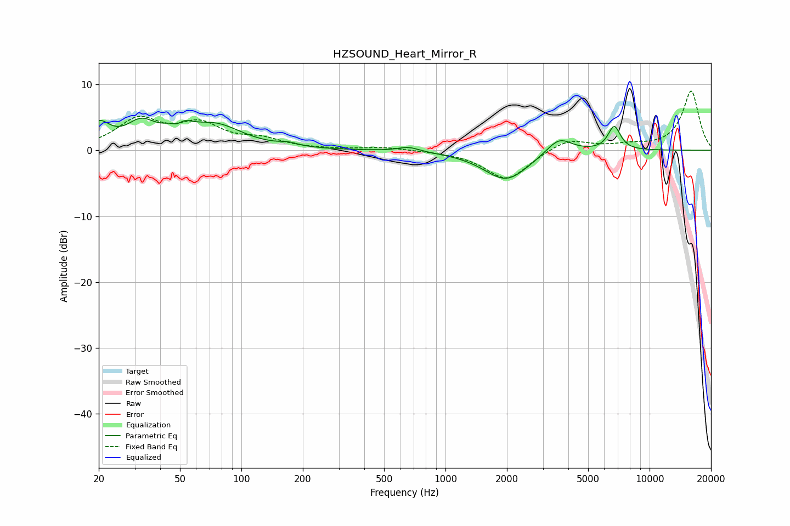

# HZSOUND_Heart_Mirror_R
See [usage instructions](https://github.com/jaakkopasanen/AutoEq#usage) for more options and info.

### Parametric EQs
Apply preamp of -5.0 dB when using parametric equalizer.

|   # | Type    |   Fc (Hz) |    Q |   Gain (dB) |
|-----|---------|-----------|------|-------------|
|   1 | Peaking |        20 | 2.65 |         3.5 |
|   2 | Peaking |        32 | 2    |         3.4 |
|   3 | Peaking |        49 | 4.35 |        -3.1 |
|   4 | Peaking |        49 | 3.1  |         4.3 |
|   5 | Peaking |        75 | 1.07 |         3.5 |
|   6 | Peaking |       170 | 3.13 |         0.5 |
|   7 | Peaking |       660 | 2.76 |         0.7 |
|   8 | Peaking |      1986 | 1.28 |        -4.6 |
|   9 | Peaking |      3600 | 2.22 |         2.5 |
|  10 | Peaking |      6713 | 4.45 |         3.6 |

### Fixed Band EQs
When using fixed band (also called graphic) equalizer, apply preamp of **-9.1 dB** (if available) and set gains manually with these parameters.

|   # | Type    |   Fc (Hz) |    Q |   Gain (dB) |
|-----|---------|-----------|------|-------------|
|   1 | Peaking |        31 | 1.41 |         4.4 |
|   2 | Peaking |        62 | 1.41 |         3.5 |
|   3 | Peaking |       125 | 1.41 |         1.4 |
|   4 | Peaking |       250 | 1.41 |         0.1 |
|   5 | Peaking |       500 | 1.41 |         0.4 |
|   6 | Peaking |      1000 | 1.41 |        -0.1 |
|   7 | Peaking |      2000 | 1.41 |        -4.5 |
|   8 | Peaking |      4000 | 1.41 |         1.8 |
|   9 | Peaking |      8000 | 1.41 |         0.6 |
|  10 | Peaking |     16000 | 1.41 |         9   |

### Graphs

