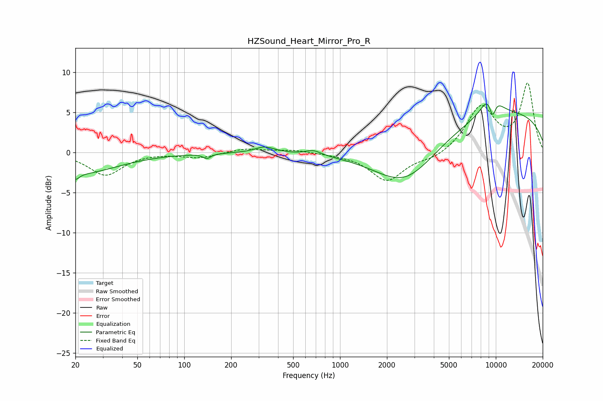

# HZSound_Heart_Mirror_Pro_R
See [usage instructions](https://github.com/jaakkopasanen/AutoEq#usage) for more options and info.

### Parametric EQs
Apply preamp of -6.2 dB when using parametric equalizer.

|   # | Type    |   Fc (Hz) |    Q |   Gain (dB) |
|-----|---------|-----------|------|-------------|
|   1 | Peaking |        20 | 5.99 |        -0.8 |
|   2 | Peaking |        21 | 0.57 |        -2.6 |
|   3 | Peaking |       140 | 5.86 |        -0.6 |
|   4 | Peaking |       329 | 2.19 |         0.8 |
|   5 | Peaking |       673 | 2.85 |         0.6 |
|   6 | Peaking |      2647 | 0.65 |        -6.7 |
|   7 | Peaking |      9023 | 0.18 |         5.3 |
|   8 | Peaking |      9330 | 2.39 |         4.1 |
|   9 | Peaking |      9513 | 4.47 |        -2.1 |
|  10 | Peaking |      9514 | 5.87 |        -1.6 |

### Fixed Band EQs
When using fixed band (also called graphic) equalizer, apply preamp of **-8.8 dB** (if available) and set gains manually with these parameters.

|   # | Type    |   Fc (Hz) |    Q |   Gain (dB) |
|-----|---------|-----------|------|-------------|
|   1 | Peaking |        31 | 1.41 |        -2.8 |
|   2 | Peaking |        62 | 1.41 |         0   |
|   3 | Peaking |       125 | 1.41 |        -0.6 |
|   4 | Peaking |       250 | 1.41 |         0.5 |
|   5 | Peaking |       500 | 1.41 |         0.3 |
|   6 | Peaking |      1000 | 1.41 |        -0.1 |
|   7 | Peaking |      2000 | 1.41 |        -3.5 |
|   8 | Peaking |      4000 | 1.41 |        -0.8 |
|   9 | Peaking |      8000 | 1.41 |         5.6 |
|  10 | Peaking |     16000 | 1.41 |         8.4 |

### Graphs

