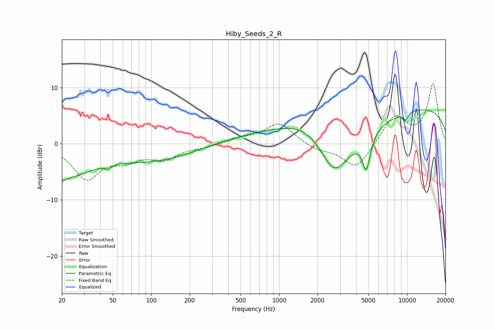

# Hiby_Seeds_2_R
See [usage instructions](https://github.com/jaakkopasanen/AutoEq#usage) for more options and info.

### Parametric EQs
Apply preamp of -6.1 dB when using parametric equalizer.

|   # | Type    |   Fc (Hz) |    Q |   Gain (dB) |
|-----|---------|-----------|------|-------------|
|   1 | Peaking |        20 | 3.47 |        -1.5 |
|   2 | Peaking |        23 | 0.77 |        -4.7 |
|   3 | Peaking |        46 | 5.52 |        -0.6 |
|   4 | Peaking |       123 | 0.39 |        -3.5 |
|   5 | Peaking |       651 | 0.22 |         2   |
|   6 | Peaking |      1948 | 0.57 |         7.3 |
|   7 | Peaking |      2674 | 0.75 |       -15.9 |
|   8 | Peaking |      4808 | 4.45 |        -6.1 |
|   9 | Peaking |      9721 | 0.18 |         6.9 |
|  10 | Peaking |      9730 | 5.99 |        -1.3 |

### Fixed Band EQs
When using fixed band (also called graphic) equalizer, apply preamp of **-10.8 dB** (if available) and set gains manually with these parameters.

|   # | Type    |   Fc (Hz) |    Q |   Gain (dB) |
|-----|---------|-----------|------|-------------|
|   1 | Peaking |        31 | 1.41 |        -6   |
|   2 | Peaking |        62 | 1.41 |        -2.3 |
|   3 | Peaking |       125 | 1.41 |        -2.4 |
|   4 | Peaking |       250 | 1.41 |        -0.6 |
|   5 | Peaking |       500 | 1.41 |         0.8 |
|   6 | Peaking |      1000 | 1.41 |         3.7 |
|   7 | Peaking |      2000 | 1.41 |        -1.1 |
|   8 | Peaking |      4000 | 1.41 |        -4.6 |
|   9 | Peaking |      8000 | 1.41 |         5   |
|  10 | Peaking |     16000 | 1.41 |        10.5 |

### Graphs

