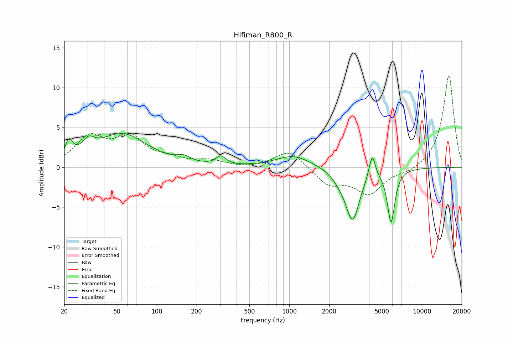

# Hifiman_R800_R
See [usage instructions](https://github.com/jaakkopasanen/AutoEq#usage) for more options and info.

### Parametric EQs
Apply preamp of -4.3 dB when using parametric equalizer.

|   # | Type    |   Fc (Hz) |    Q |   Gain (dB) |
|-----|---------|-----------|------|-------------|
|   1 | Peaking |        22 | 5.29 |         2.1 |
|   2 | Peaking |        30 | 3.13 |         1.6 |
|   3 | Peaking |        55 | 0.76 |         4.1 |
|   4 | Peaking |       159 | 2.96 |         0.6 |
|   5 | Peaking |       305 | 4.08 |         1.1 |
|   6 | Peaking |      1074 | 1.11 |         1.5 |
|   7 | Peaking |      2377 | 2.49 |        -0.7 |
|   8 | Peaking |      3004 | 2.68 |        -6.4 |
|   9 | Peaking |      4219 | 6    |         3   |
|  10 | Peaking |      5866 | 4.98 |        -6.7 |

### Fixed Band EQs
When using fixed band (also called graphic) equalizer, apply preamp of **-11.6 dB** (if available) and set gains manually with these parameters.

|   # | Type    |   Fc (Hz) |    Q |   Gain (dB) |
|-----|---------|-----------|------|-------------|
|   1 | Peaking |        31 | 1.41 |         3.5 |
|   2 | Peaking |        62 | 1.41 |         3.5 |
|   3 | Peaking |       125 | 1.41 |         0.8 |
|   4 | Peaking |       250 | 1.41 |         0.7 |
|   5 | Peaking |       500 | 1.41 |        -0.2 |
|   6 | Peaking |      1000 | 1.41 |         2.2 |
|   7 | Peaking |      2000 | 1.41 |        -2.1 |
|   8 | Peaking |      4000 | 1.41 |        -3.2 |
|   9 | Peaking |      8000 | 1.41 |        -0.6 |
|  10 | Peaking |     16000 | 1.41 |        11.6 |

### Graphs

