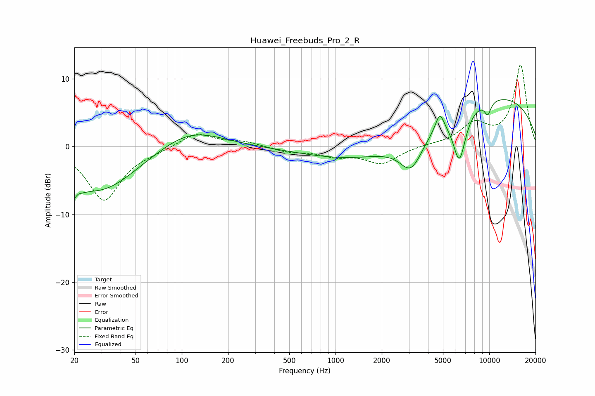

# Huawei_Freebuds_Pro_2_R
See [usage instructions](https://github.com/jaakkopasanen/AutoEq#usage) for more options and info.

### Parametric EQs
Apply preamp of -7.0 dB when using parametric equalizer.

|   # | Type    |   Fc (Hz) |    Q |   Gain (dB) |
|-----|---------|-----------|------|-------------|
|   1 | Peaking |        20 | 4.34 |        -5.3 |
|   2 | Peaking |        21 | 5.59 |         3.1 |
|   3 | Peaking |        30 | 0.59 |        -6.5 |
|   4 | Peaking |       112 | 0.7  |         2.9 |
|   5 | Peaking |      1979 | 0.33 |        -2.9 |
|   6 | Peaking |      3102 | 1.89 |        -4.7 |
|   7 | Peaking |      4765 | 4.8  |         2.7 |
|   8 | Peaking |      6395 | 3.25 |        -7.3 |
|   9 | Peaking |      9783 | 5.79 |        -1.9 |
|  10 | Peaking |      9890 | 0.25 |         7.8 |

### Fixed Band EQs
When using fixed band (also called graphic) equalizer, apply preamp of **-12.1 dB** (if available) and set gains manually with these parameters.

|   # | Type    |   Fc (Hz) |    Q |   Gain (dB) |
|-----|---------|-----------|------|-------------|
|   1 | Peaking |        31 | 1.41 |        -7.9 |
|   2 | Peaking |        62 | 1.41 |        -0.5 |
|   3 | Peaking |       125 | 1.41 |         2.1 |
|   4 | Peaking |       250 | 1.41 |         0.7 |
|   5 | Peaking |       500 | 1.41 |        -0.7 |
|   6 | Peaking |      1000 | 1.41 |        -1.2 |
|   7 | Peaking |      2000 | 1.41 |        -2.4 |
|   8 | Peaking |      4000 | 1.41 |         0.2 |
|   9 | Peaking |      8000 | 1.41 |         3.1 |
|  10 | Peaking |     16000 | 1.41 |        12   |

### Graphs

