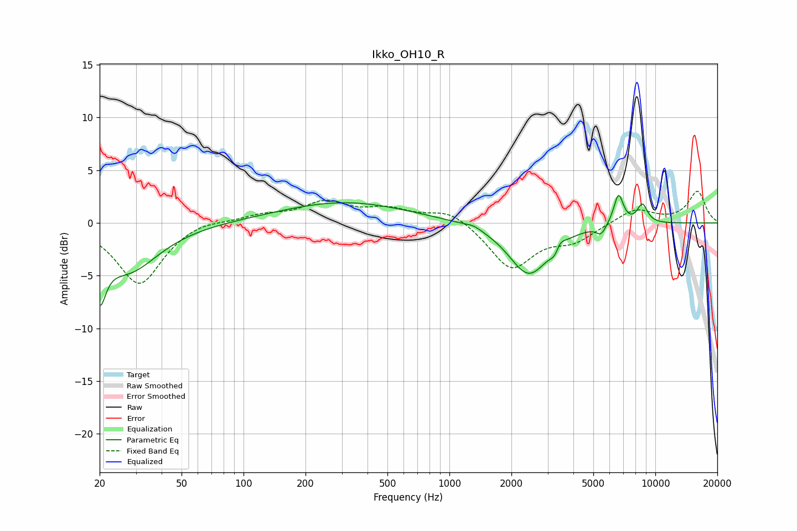

# Ikko_OH10_R
See [usage instructions](https://github.com/jaakkopasanen/AutoEq#usage) for more options and info.

### Parametric EQs
Apply preamp of -2.7 dB when using parametric equalizer.

|   # | Type    |   Fc (Hz) |    Q |   Gain (dB) |
|-----|---------|-----------|------|-------------|
|   1 | Peaking |        20 | 4.8  |        -4.6 |
|   2 | Peaking |        27 | 0.96 |        -4.5 |
|   3 | Peaking |       308 | 0.45 |         2   |
|   4 | Peaking |      1309 | 3.69 |         0.3 |
|   5 | Peaking |      2431 | 1.45 |        -4.9 |
|   6 | Peaking |      3275 | 5.98 |        -1.1 |
|   7 | Peaking |      3413 | 6    |         1   |
|   8 | Peaking |      5458 | 6    |        -0.9 |
|   9 | Peaking |      6628 | 5.76 |         2.9 |
|  10 | Peaking |      8653 | 5.09 |         1.8 |

### Fixed Band EQs
When using fixed band (also called graphic) equalizer, apply preamp of **-3.1 dB** (if available) and set gains manually with these parameters.

|   # | Type    |   Fc (Hz) |    Q |   Gain (dB) |
|-----|---------|-----------|------|-------------|
|   1 | Peaking |        31 | 1.41 |        -5.8 |
|   2 | Peaking |        62 | 1.41 |         0.5 |
|   3 | Peaking |       125 | 1.41 |         0.7 |
|   4 | Peaking |       250 | 1.41 |         1.9 |
|   5 | Peaking |       500 | 1.41 |         1.1 |
|   6 | Peaking |      1000 | 1.41 |         1.3 |
|   7 | Peaking |      2000 | 1.41 |        -4.3 |
|   8 | Peaking |      4000 | 1.41 |        -1.5 |
|   9 | Peaking |      8000 | 1.41 |         1.4 |
|  10 | Peaking |     16000 | 1.41 |         3   |

### Graphs

