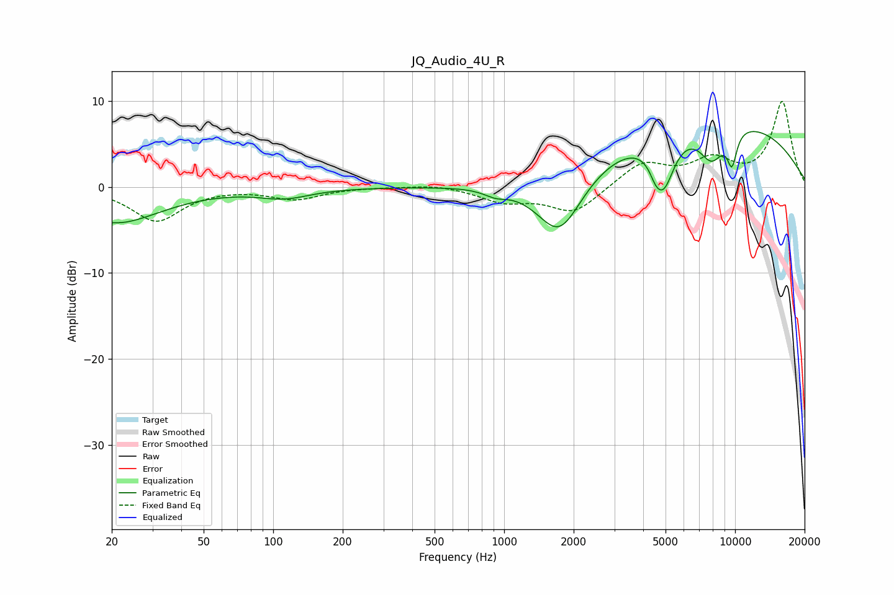

# JQ_Audio_4U_R
See [usage instructions](https://github.com/jaakkopasanen/AutoEq#usage) for more options and info.

### Parametric EQs
Apply preamp of -6.6 dB when using parametric equalizer.

|   # | Type    |   Fc (Hz) |    Q |   Gain (dB) |
|-----|---------|-----------|------|-------------|
|   1 | Peaking |        20 | 0.69 |        -4.2 |
|   2 | Peaking |        20 | 4.7  |         0.1 |
|   3 | Peaking |       112 | 1.28 |        -1.1 |
|   4 | Peaking |       917 | 2.8  |        -0.8 |
|   5 | Peaking |      1737 | 1.37 |        -7.6 |
|   6 | Peaking |      4522 | 5.89 |        -1   |
|   7 | Peaking |      4894 | 2.87 |        -6.1 |
|   8 | Peaking |      7832 | 0.26 |         8.2 |
|   9 | Peaking |      7913 | 2.4  |        -4.1 |
|  10 | Peaking |      9699 | 5.88 |        -3.8 |

### Fixed Band EQs
When using fixed band (also called graphic) equalizer, apply preamp of **-10.1 dB** (if available) and set gains manually with these parameters.

|   # | Type    |   Fc (Hz) |    Q |   Gain (dB) |
|-----|---------|-----------|------|-------------|
|   1 | Peaking |        31 | 1.41 |        -3.9 |
|   2 | Peaking |        62 | 1.41 |        -0   |
|   3 | Peaking |       125 | 1.41 |        -1.4 |
|   4 | Peaking |       250 | 1.41 |         0   |
|   5 | Peaking |       500 | 1.41 |         0.4 |
|   6 | Peaking |      1000 | 1.41 |        -1.6 |
|   7 | Peaking |      2000 | 1.41 |        -3   |
|   8 | Peaking |      4000 | 1.41 |         2.8 |
|   9 | Peaking |      8000 | 1.41 |         2.9 |
|  10 | Peaking |     16000 | 1.41 |         9.9 |

### Graphs

