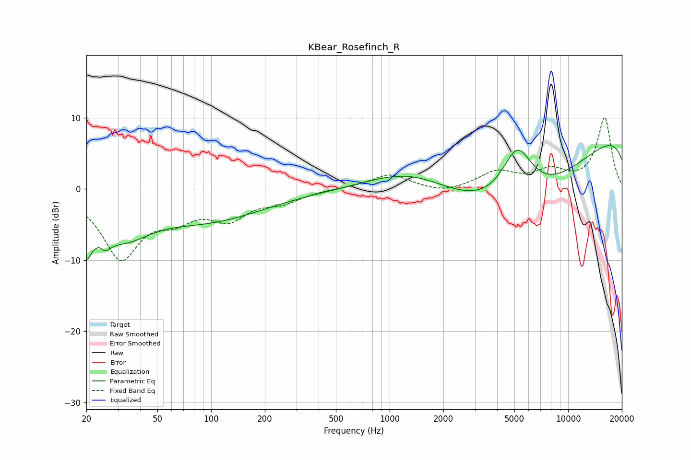

# KBear_Rosefinch_R
See [usage instructions](https://github.com/jaakkopasanen/AutoEq#usage) for more options and info.

### Parametric EQs
Apply preamp of -6.2 dB when using parametric equalizer.

|   # | Type    |   Fc (Hz) |    Q |   Gain (dB) |
|-----|---------|-----------|------|-------------|
|   1 | Peaking |        20 | 5.6  |        -4.7 |
|   2 | Peaking |        24 | 5.72 |         2.5 |
|   3 | Peaking |        24 | 3.72 |        -4.7 |
|   4 | Peaking |        33 | 1.01 |        -4.2 |
|   5 | Peaking |        48 | 0.2  |        -1.9 |
|   6 | Peaking |        99 | 0.49 |        -2.6 |
|   7 | Peaking |      1302 | 0.53 |         5.2 |
|   8 | Peaking |      5183 | 1.47 |         8.7 |
|   9 | Peaking |      5305 | 0.27 |       -16.9 |
|  10 | Peaking |     10000 | 0.18 |        14.4 |

### Fixed Band EQs
When using fixed band (also called graphic) equalizer, apply preamp of **-10.1 dB** (if available) and set gains manually with these parameters.

|   # | Type    |   Fc (Hz) |    Q |   Gain (dB) |
|-----|---------|-----------|------|-------------|
|   1 | Peaking |        31 | 1.41 |        -9.4 |
|   2 | Peaking |        62 | 1.41 |        -3.1 |
|   3 | Peaking |       125 | 1.41 |        -3.7 |
|   4 | Peaking |       250 | 1.41 |        -1.6 |
|   5 | Peaking |       500 | 1.41 |         0.1 |
|   6 | Peaking |      1000 | 1.41 |         2.1 |
|   7 | Peaking |      2000 | 1.41 |        -0.7 |
|   8 | Peaking |      4000 | 1.41 |         2.3 |
|   9 | Peaking |      8000 | 1.41 |         2.2 |
|  10 | Peaking |     16000 | 1.41 |        10   |

### Graphs

