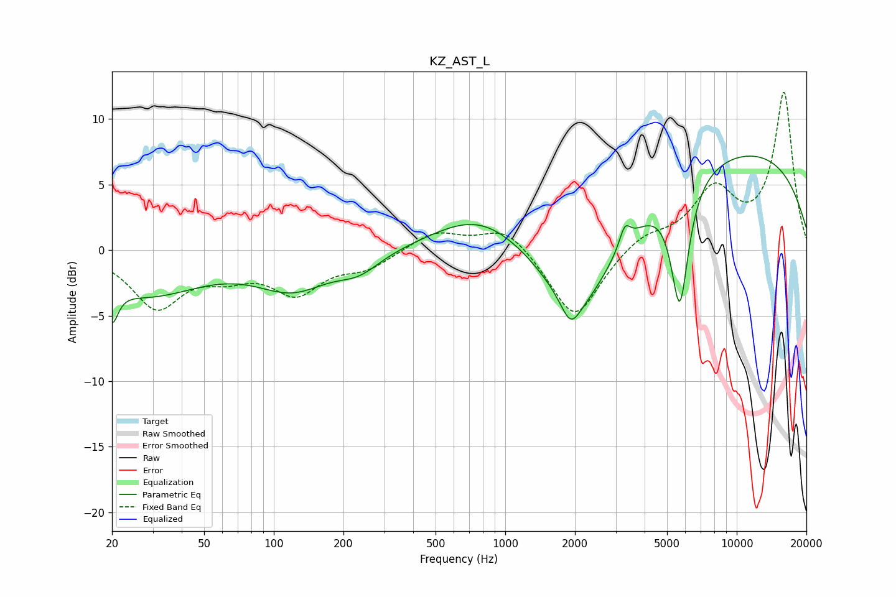

# KZ_AST_L
See [usage instructions](https://github.com/jaakkopasanen/AutoEq#usage) for more options and info.

### Parametric EQs
Apply preamp of -7.3 dB when using parametric equalizer.

|   # | Type    |   Fc (Hz) |    Q |   Gain (dB) |
|-----|---------|-----------|------|-------------|
|   1 | Peaking |        20 | 5.57 |        -2.7 |
|   2 | Peaking |        28 | 0.6  |        -3.3 |
|   3 | Peaking |       121 | 0.9  |        -2.7 |
|   4 | Peaking |       234 | 1.54 |        -1.3 |
|   5 | Peaking |       778 | 0.71 |         2.9 |
|   6 | Peaking |      1916 | 3.54 |        -1.9 |
|   7 | Peaking |      2100 | 0.88 |        -6.7 |
|   8 | Peaking |      3285 | 5.99 |         1.6 |
|   9 | Peaking |      5675 | 3.6  |        -9.4 |
|  10 | Peaking |      9949 | 0.25 |         7.6 |

### Fixed Band EQs
When using fixed band (also called graphic) equalizer, apply preamp of **-12.1 dB** (if available) and set gains manually with these parameters.

|   # | Type    |   Fc (Hz) |    Q |   Gain (dB) |
|-----|---------|-----------|------|-------------|
|   1 | Peaking |        31 | 1.41 |        -4.2 |
|   2 | Peaking |        62 | 1.41 |        -1.4 |
|   3 | Peaking |       125 | 1.41 |        -3   |
|   4 | Peaking |       250 | 1.41 |        -1.2 |
|   5 | Peaking |       500 | 1.41 |         1.4 |
|   6 | Peaking |      1000 | 1.41 |         1.9 |
|   7 | Peaking |      2000 | 1.41 |        -5.4 |
|   8 | Peaking |      4000 | 1.41 |         1.2 |
|   9 | Peaking |      8000 | 1.41 |         4.3 |
|  10 | Peaking |     16000 | 1.41 |        11.9 |

### Graphs

