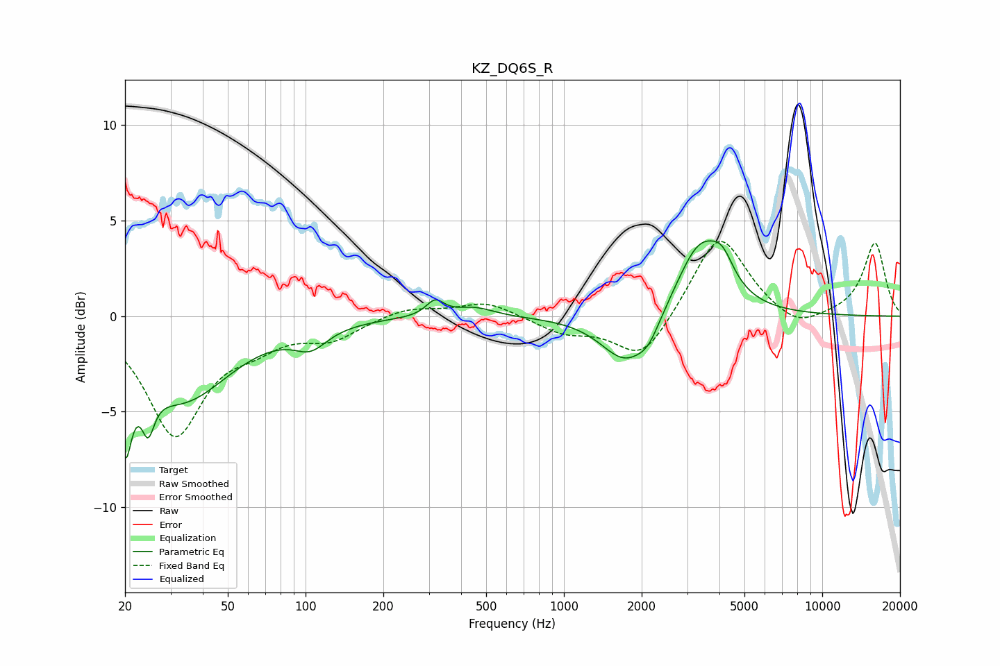

# KZ_DQ6S_R
See [usage instructions](https://github.com/jaakkopasanen/AutoEq#usage) for more options and info.

### Parametric EQs
Apply preamp of -4.0 dB when using parametric equalizer.

|   # | Type    |   Fc (Hz) |    Q |   Gain (dB) |
|-----|---------|-----------|------|-------------|
|   1 | Peaking |        20 | 5.79 |        -4.5 |
|   2 | Peaking |        25 | 5.91 |        -2.1 |
|   3 | Peaking |        33 | 0.76 |        -4.3 |
|   4 | Peaking |       105 | 2.17 |        -1.1 |
|   5 | Peaking |       317 | 4.1  |         0.8 |
|   6 | Peaking |       450 | 1.87 |         0.5 |
|   7 | Peaking |      1740 | 1.47 |        -2.6 |
|   8 | Peaking |      2130 | 3.25 |        -0.8 |
|   9 | Peaking |      3368 | 1.53 |         3.9 |
|  10 | Peaking |      4112 | 3.27 |         1.2 |

### Fixed Band EQs
When using fixed band (also called graphic) equalizer, apply preamp of **-4.0 dB** (if available) and set gains manually with these parameters.

|   # | Type    |   Fc (Hz) |    Q |   Gain (dB) |
|-----|---------|-----------|------|-------------|
|   1 | Peaking |        31 | 1.41 |        -6.1 |
|   2 | Peaking |        62 | 1.41 |        -1   |
|   3 | Peaking |       125 | 1.41 |        -1.1 |
|   4 | Peaking |       250 | 1.41 |         0.5 |
|   5 | Peaking |       500 | 1.41 |         0.8 |
|   6 | Peaking |      1000 | 1.41 |        -0.8 |
|   7 | Peaking |      2000 | 1.41 |        -2.4 |
|   8 | Peaking |      4000 | 1.41 |         4.4 |
|   9 | Peaking |      8000 | 1.41 |        -0.8 |
|  10 | Peaking |     16000 | 1.41 |         3.8 |

### Graphs

