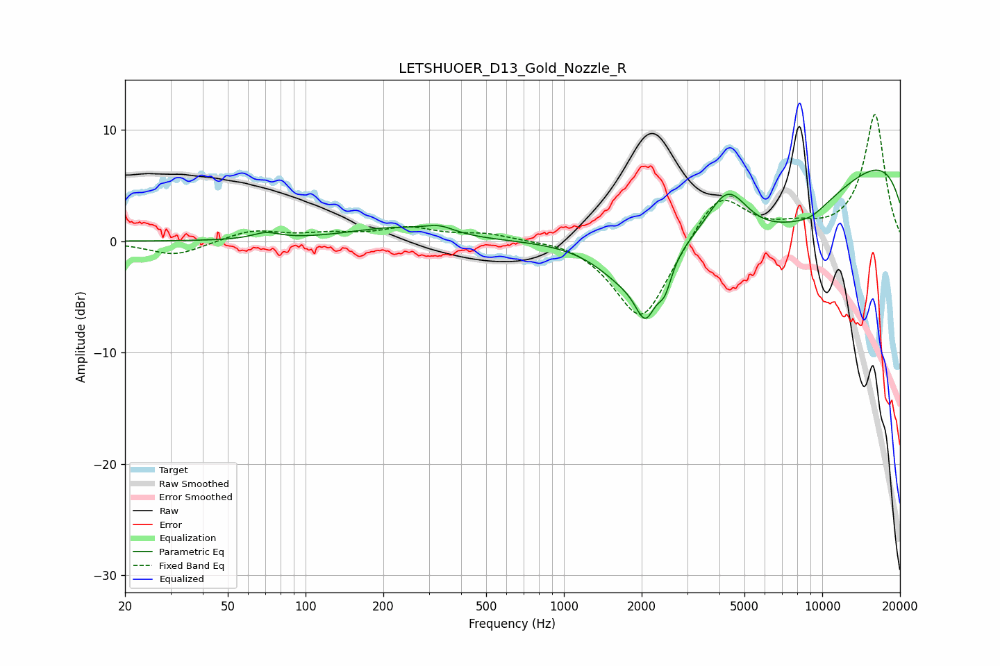

# LETSHUOER_D13_Gold_Nozzle_R
See [usage instructions](https://github.com/jaakkopasanen/AutoEq#usage) for more options and info.

### Parametric EQs
Apply preamp of -6.5 dB when using parametric equalizer.

|   # | Type    |   Fc (Hz) |    Q |   Gain (dB) |
|-----|---------|-----------|------|-------------|
|   1 | Peaking |        70 | 2.77 |         0.6 |
|   2 | Peaking |       215 | 0.82 |         1.1 |
|   3 | Peaking |       330 | 2.34 |         0.7 |
|   4 | Peaking |      1739 | 1.21 |        -3.5 |
|   5 | Peaking |      2072 | 3.49 |        -4.3 |
|   6 | Peaking |      2458 | 5.12 |        -2.3 |
|   7 | Peaking |      4301 | 1.73 |         4.8 |
|   8 | Peaking |      5849 | 0.36 |        -9.2 |
|   9 | Peaking |      9012 | 1.8  |        -0.8 |
|  10 | Peaking |     10000 | 0.18 |        10.5 |

### Fixed Band EQs
When using fixed band (also called graphic) equalizer, apply preamp of **-11.5 dB** (if available) and set gains manually with these parameters.

|   # | Type    |   Fc (Hz) |    Q |   Gain (dB) |
|-----|---------|-----------|------|-------------|
|   1 | Peaking |        31 | 1.41 |        -1.3 |
|   2 | Peaking |        62 | 1.41 |         1   |
|   3 | Peaking |       125 | 1.41 |         0.5 |
|   4 | Peaking |       250 | 1.41 |         1.1 |
|   5 | Peaking |       500 | 1.41 |         0.7 |
|   6 | Peaking |      1000 | 1.41 |         0.3 |
|   7 | Peaking |      2000 | 1.41 |        -7.5 |
|   8 | Peaking |      4000 | 1.41 |         4.7 |
|   9 | Peaking |      8000 | 1.41 |         0.9 |
|  10 | Peaking |     16000 | 1.41 |        11.4 |

### Graphs

