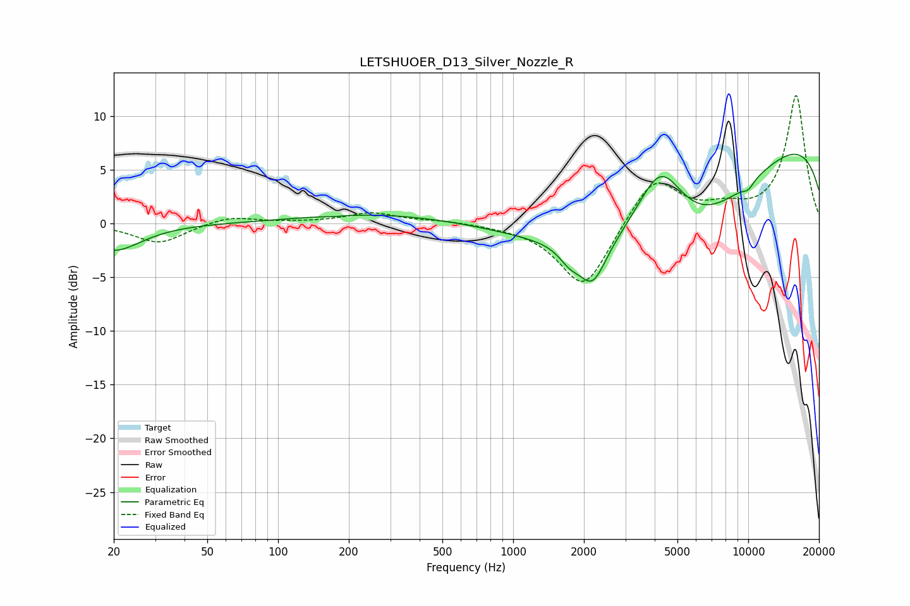

# LETSHUOER_D13_Silver_Nozzle_R
See [usage instructions](https://github.com/jaakkopasanen/AutoEq#usage) for more options and info.

### Parametric EQs
Apply preamp of -6.5 dB when using parametric equalizer.

|   # | Type    |   Fc (Hz) |    Q |   Gain (dB) |
|-----|---------|-----------|------|-------------|
|   1 | Peaking |        20 | 1.22 |        -2.5 |
|   2 | Peaking |       172 | 4.66 |        -0.1 |
|   3 | Peaking |       274 | 0.42 |         0.9 |
|   4 | Peaking |       658 | 3.57 |         0   |
|   5 | Peaking |      1733 | 3.2  |        -1.2 |
|   6 | Peaking |      2175 | 2.38 |        -4.1 |
|   7 | Peaking |      4232 | 1.27 |         8   |
|   8 | Peaking |      5182 | 0.36 |       -12.8 |
|   9 | Peaking |      9938 | 0.21 |        11.7 |
|  10 | Peaking |     10000 | 5.03 |        -0.6 |

### Fixed Band EQs
When using fixed band (also called graphic) equalizer, apply preamp of **-12.0 dB** (if available) and set gains manually with these parameters.

|   # | Type    |   Fc (Hz) |    Q |   Gain (dB) |
|-----|---------|-----------|------|-------------|
|   1 | Peaking |        31 | 1.41 |        -1.8 |
|   2 | Peaking |        62 | 1.41 |         0.7 |
|   3 | Peaking |       125 | 1.41 |         0.1 |
|   4 | Peaking |       250 | 1.41 |         1   |
|   5 | Peaking |       500 | 1.41 |         0.3 |
|   6 | Peaking |      1000 | 1.41 |        -0.1 |
|   7 | Peaking |      2000 | 1.41 |        -6.2 |
|   8 | Peaking |      4000 | 1.41 |         4.5 |
|   9 | Peaking |      8000 | 1.41 |         1.1 |
|  10 | Peaking |     16000 | 1.41 |        11.9 |

### Graphs

