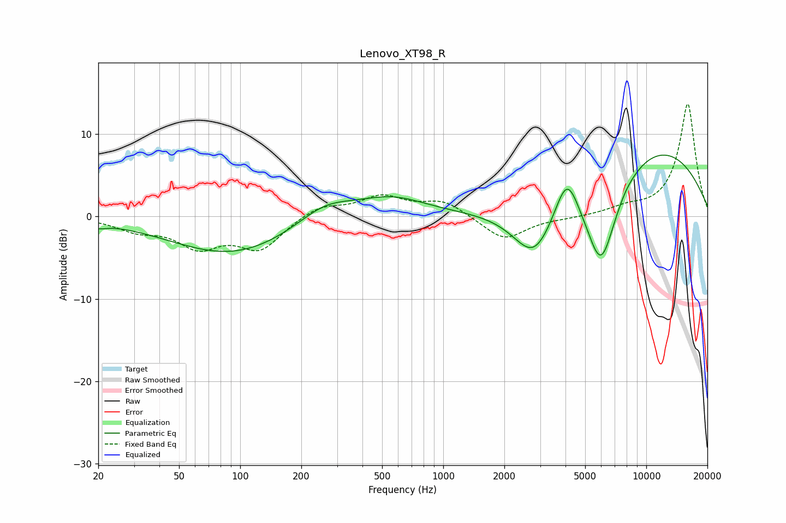

# Lenovo_XT98_R
See [usage instructions](https://github.com/jaakkopasanen/AutoEq#usage) for more options and info.

### Parametric EQs
Apply preamp of -7.5 dB when using parametric equalizer.

|   # | Type    |   Fc (Hz) |    Q |   Gain (dB) |
|-----|---------|-----------|------|-------------|
|   1 | Peaking |        20 | 3.53 |        -0.6 |
|   2 | Peaking |        92 | 0.46 |        -4.6 |
|   3 | Peaking |       261 | 1.01 |         2.4 |
|   4 | Peaking |       555 | 0.82 |         2.3 |
|   5 | Peaking |      2808 | 1.31 |        -6.9 |
|   6 | Peaking |      3856 | 2.61 |         0.5 |
|   7 | Peaking |      4087 | 2.44 |         5.1 |
|   8 | Peaking |      5987 | 1.64 |       -12   |
|   9 | Peaking |      7959 | 4.9  |         0.1 |
|  10 | Peaking |     10000 | 0.32 |         9   |

### Fixed Band EQs
When using fixed band (also called graphic) equalizer, apply preamp of **-13.7 dB** (if available) and set gains manually with these parameters.

|   # | Type    |   Fc (Hz) |    Q |   Gain (dB) |
|-----|---------|-----------|------|-------------|
|   1 | Peaking |        31 | 1.41 |        -1.4 |
|   2 | Peaking |        62 | 1.41 |        -3.3 |
|   3 | Peaking |       125 | 1.41 |        -3.8 |
|   4 | Peaking |       250 | 1.41 |         1.4 |
|   5 | Peaking |       500 | 1.41 |         2.3 |
|   6 | Peaking |      1000 | 1.41 |         1.8 |
|   7 | Peaking |      2000 | 1.41 |        -2.9 |
|   8 | Peaking |      4000 | 1.41 |        -0.2 |
|   9 | Peaking |      8000 | 1.41 |         0.8 |
|  10 | Peaking |     16000 | 1.41 |        13.7 |

### Graphs

