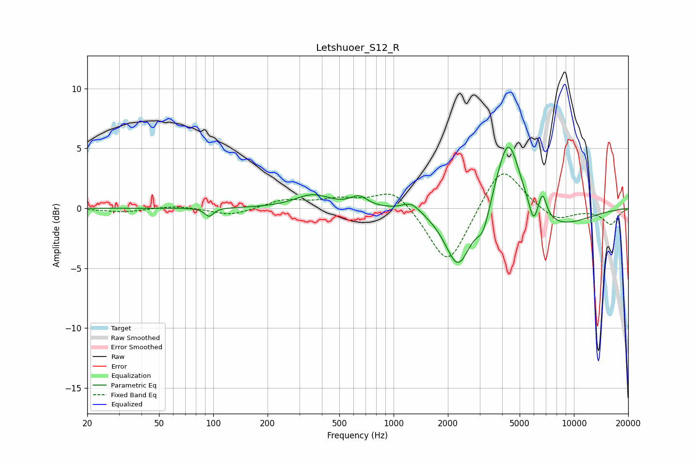

# Letshuoer_S12_R
See [usage instructions](https://github.com/jaakkopasanen/AutoEq#usage) for more options and info.

### Parametric EQs
Apply preamp of -5.2 dB when using parametric equalizer.

|   # | Type    |   Fc (Hz) |    Q |   Gain (dB) |
|-----|---------|-----------|------|-------------|
|   1 | Peaking |        95 | 5.97 |        -0.7 |
|   2 | Peaking |       355 | 1.45 |         1.1 |
|   3 | Peaking |       644 | 3.02 |         0.8 |
|   4 | Peaking |      1251 | 2.8  |         0.8 |
|   5 | Peaking |      2277 | 1.99 |        -4.8 |
|   6 | Peaking |      3142 | 3.94 |        -1.9 |
|   7 | Peaking |      4317 | 2.07 |         6.8 |
|   8 | Peaking |      5962 | 6    |        -1.7 |
|   9 | Peaking |      6695 | 6    |         1.9 |
|  10 | Peaking |      7744 | 0.69 |        -1.7 |

### Fixed Band EQs
When using fixed band (also called graphic) equalizer, apply preamp of **-3.0 dB** (if available) and set gains manually with these parameters.

|   # | Type    |   Fc (Hz) |    Q |   Gain (dB) |
|-----|---------|-----------|------|-------------|
|   1 | Peaking |        31 | 1.41 |        -0.3 |
|   2 | Peaking |        62 | 1.41 |         0.2 |
|   3 | Peaking |       125 | 1.41 |        -0.6 |
|   4 | Peaking |       250 | 1.41 |         0.7 |
|   5 | Peaking |       500 | 1.41 |         0.7 |
|   6 | Peaking |      1000 | 1.41 |         1.7 |
|   7 | Peaking |      2000 | 1.41 |        -5   |
|   8 | Peaking |      4000 | 1.41 |         3.8 |
|   9 | Peaking |      8000 | 1.41 |        -1.1 |
|  10 | Peaking |     16000 | 1.41 |        -1.3 |

### Graphs

