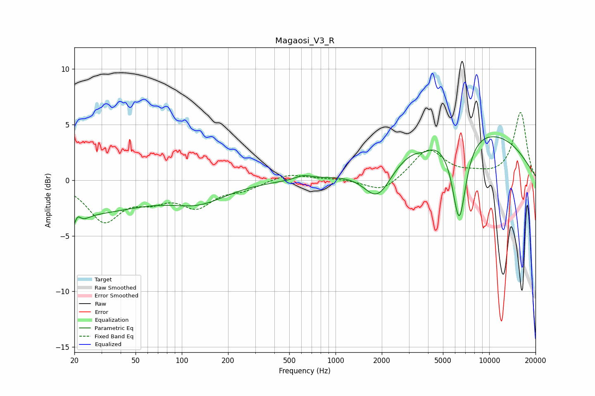

# Magaosi_V3_R
See [usage instructions](https://github.com/jaakkopasanen/AutoEq#usage) for more options and info.

### Parametric EQs
Apply preamp of -4.0 dB when using parametric equalizer.

|   # | Type    |   Fc (Hz) |    Q |   Gain (dB) |
|-----|---------|-----------|------|-------------|
|   1 | Peaking |        20 | 5.37 |        -3   |
|   2 | Peaking |        20 | 0.31 |        -3   |
|   3 | Peaking |        21 | 6    |         2.5 |
|   4 | Peaking |        23 | 3.61 |        -0.4 |
|   5 | Peaking |       130 | 0.78 |        -1.6 |
|   6 | Peaking |       618 | 2.75 |         0.4 |
|   7 | Peaking |      1882 | 1.53 |        -3.3 |
|   8 | Peaking |      3738 | 3.51 |        -0.4 |
|   9 | Peaking |      6374 | 2.99 |        -7.8 |
|  10 | Peaking |      7237 | 0.28 |         4.8 |

### Fixed Band EQs
When using fixed band (also called graphic) equalizer, apply preamp of **-6.2 dB** (if available) and set gains manually with these parameters.

|   # | Type    |   Fc (Hz) |    Q |   Gain (dB) |
|-----|---------|-----------|------|-------------|
|   1 | Peaking |        31 | 1.41 |        -3.5 |
|   2 | Peaking |        62 | 1.41 |        -1.3 |
|   3 | Peaking |       125 | 1.41 |        -2.1 |
|   4 | Peaking |       250 | 1.41 |        -0.7 |
|   5 | Peaking |       500 | 1.41 |         0.6 |
|   6 | Peaking |      1000 | 1.41 |         0.1 |
|   7 | Peaking |      2000 | 1.41 |        -1.2 |
|   8 | Peaking |      4000 | 1.41 |         2.8 |
|   9 | Peaking |      8000 | 1.41 |         0.4 |
|  10 | Peaking |     16000 | 1.41 |         6.1 |

### Graphs

