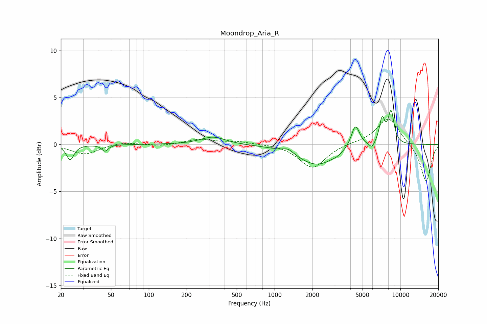

# Moondrop_Aria_R
See [usage instructions](https://github.com/jaakkopasanen/AutoEq#usage) for more options and info.

### Parametric EQs
Apply preamp of -3.8 dB when using parametric equalizer.

|   # | Type    |   Fc (Hz) |    Q |   Gain (dB) |
|-----|---------|-----------|------|-------------|
|   1 | Peaking |        24 | 4.91 |        -1.6 |
|   2 | Peaking |        45 | 5.8  |        -0.7 |
|   3 | Peaking |       324 | 1.44 |         0.8 |
|   4 | Peaking |      1281 | 3.49 |         0.5 |
|   5 | Peaking |      2177 | 0.93 |        -2.2 |
|   6 | Peaking |      3131 | 4.55 |        -0.1 |
|   7 | Peaking |      4389 | 4.08 |         2.5 |
|   8 | Peaking |      5937 | 6    |        -0.6 |
|   9 | Peaking |      7151 | 5.89 |         2.6 |
|  10 | Peaking |      8424 | 5.49 |         3.4 |

### Fixed Band EQs
When using fixed band (also called graphic) equalizer, apply preamp of **-2.8 dB** (if available) and set gains manually with these parameters.

|   # | Type    |   Fc (Hz) |    Q |   Gain (dB) |
|-----|---------|-----------|------|-------------|
|   1 | Peaking |        31 | 1.41 |        -1   |
|   2 | Peaking |        62 | 1.41 |         0.3 |
|   3 | Peaking |       125 | 1.41 |        -0.2 |
|   4 | Peaking |       250 | 1.41 |         0.5 |
|   5 | Peaking |       500 | 1.41 |         0.3 |
|   6 | Peaking |      1000 | 1.41 |         0.1 |
|   7 | Peaking |      2000 | 1.41 |        -2.5 |
|   8 | Peaking |      4000 | 1.41 |         0.2 |
|   9 | Peaking |      8000 | 1.41 |         2.9 |
|  10 | Peaking |     16000 | 1.41 |        -4   |

### Graphs

