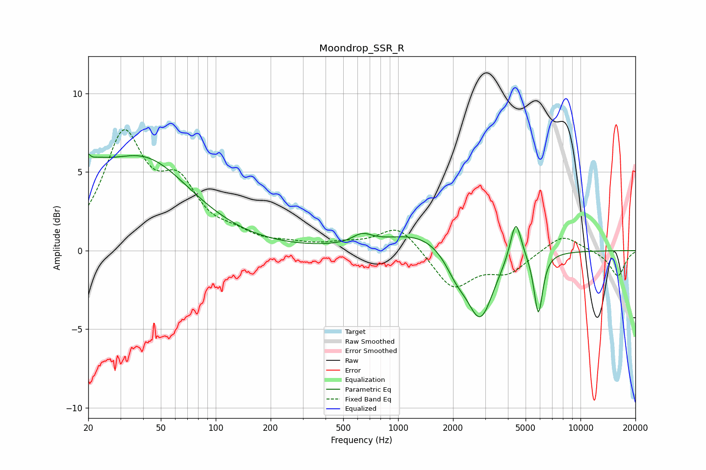

# Moondrop_SSR_R
See [usage instructions](https://github.com/jaakkopasanen/AutoEq#usage) for more options and info.

### Parametric EQs
Apply preamp of -6.3 dB when using parametric equalizer.

|   # | Type    |   Fc (Hz) |    Q |   Gain (dB) |
|-----|---------|-----------|------|-------------|
|   1 | Peaking |        20 | 5.32 |         3.6 |
|   2 | Peaking |        20 | 5.76 |        -2.7 |
|   3 | Peaking |        21 | 1.33 |         1.9 |
|   4 | Peaking |        41 | 0.54 |         5.5 |
|   5 | Peaking |       635 | 2.66 |         0.6 |
|   6 | Peaking |      1348 | 0.73 |         1.2 |
|   7 | Peaking |      2090 | 2.21 |        -1.3 |
|   8 | Peaking |      2825 | 1.97 |        -4.3 |
|   9 | Peaking |      4415 | 4.68 |         2.6 |
|  10 | Peaking |      5875 | 5.81 |        -3.9 |

### Fixed Band EQs
When using fixed band (also called graphic) equalizer, apply preamp of **-7.8 dB** (if available) and set gains manually with these parameters.

|   # | Type    |   Fc (Hz) |    Q |   Gain (dB) |
|-----|---------|-----------|------|-------------|
|   1 | Peaking |        31 | 1.41 |         7   |
|   2 | Peaking |        62 | 1.41 |         3.5 |
|   3 | Peaking |       125 | 1.41 |         0.7 |
|   4 | Peaking |       250 | 1.41 |         0.3 |
|   5 | Peaking |       500 | 1.41 |         0.3 |
|   6 | Peaking |      1000 | 1.41 |         1.6 |
|   7 | Peaking |      2000 | 1.41 |        -2.4 |
|   8 | Peaking |      4000 | 1.41 |        -1.3 |
|   9 | Peaking |      8000 | 1.41 |         1.1 |
|  10 | Peaking |     16000 | 1.41 |        -1.6 |

### Graphs

