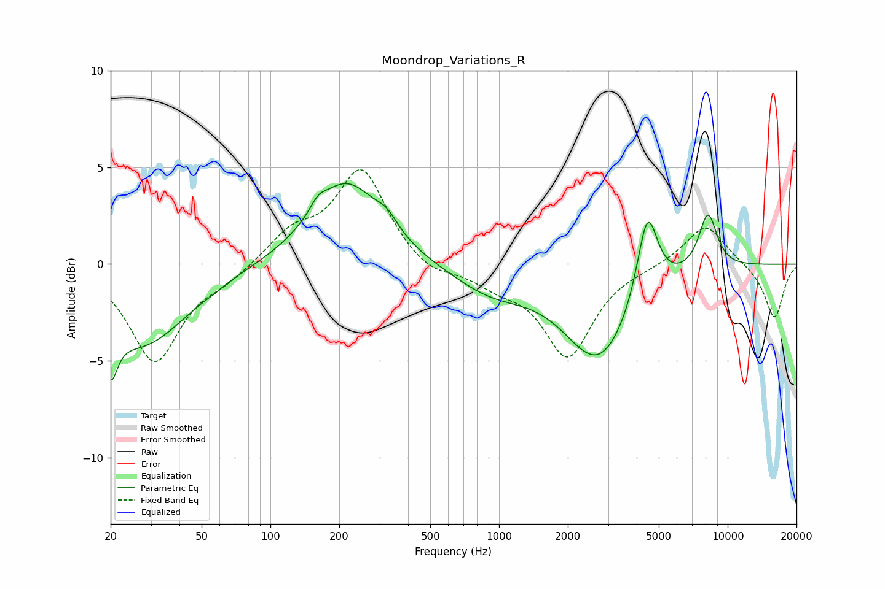

# Moondrop_Variations_R
See [usage instructions](https://github.com/jaakkopasanen/AutoEq#usage) for more options and info.

### Parametric EQs
Apply preamp of -4.3 dB when using parametric equalizer.

|   # | Type    |   Fc (Hz) |    Q |   Gain (dB) |
|-----|---------|-----------|------|-------------|
|   1 | Peaking |        20 | 4.94 |        -2.6 |
|   2 | Peaking |        27 | 0.69 |        -4.1 |
|   3 | Peaking |        57 | 6    |        -0.1 |
|   4 | Peaking |       162 | 4.18 |         0.5 |
|   5 | Peaking |       214 | 0.94 |         4.3 |
|   6 | Peaking |       324 | 3.07 |         0.7 |
|   7 | Peaking |       920 | 0.82 |        -1.3 |
|   8 | Peaking |      2739 | 0.94 |        -4.9 |
|   9 | Peaking |      4455 | 3.08 |         4.5 |
|  10 | Peaking |      8195 | 3.21 |         2.9 |

### Fixed Band EQs
When using fixed band (also called graphic) equalizer, apply preamp of **-5.0 dB** (if available) and set gains manually with these parameters.

|   # | Type    |   Fc (Hz) |    Q |   Gain (dB) |
|-----|---------|-----------|------|-------------|
|   1 | Peaking |        31 | 1.41 |        -5   |
|   2 | Peaking |        62 | 1.41 |        -0.7 |
|   3 | Peaking |       125 | 1.41 |         1.5 |
|   4 | Peaking |       250 | 1.41 |         4.9 |
|   5 | Peaking |       500 | 1.41 |        -0.7 |
|   6 | Peaking |      1000 | 1.41 |        -0.9 |
|   7 | Peaking |      2000 | 1.41 |        -4.7 |
|   8 | Peaking |      4000 | 1.41 |        -0.1 |
|   9 | Peaking |      8000 | 1.41 |         2.1 |
|  10 | Peaking |     16000 | 1.41 |        -2.8 |

### Graphs

