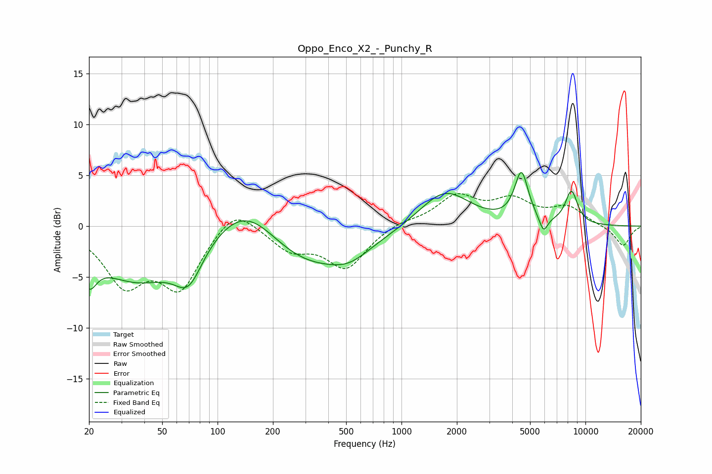

# Oppo_Enco_X2_-_Punchy_R
See [usage instructions](https://github.com/jaakkopasanen/AutoEq#usage) for more options and info.

### Parametric EQs
Apply preamp of -5.4 dB when using parametric equalizer.

|   # | Type    |   Fc (Hz) |    Q |   Gain (dB) |
|-----|---------|-----------|------|-------------|
|   1 | Peaking |        20 | 3.53 |        -2.9 |
|   2 | Peaking |        37 | 0.6  |        -5.2 |
|   3 | Peaking |        70 | 1.85 |        -3.7 |
|   4 | Peaking |       145 | 0.74 |         5.2 |
|   5 | Peaking |       273 | 0.49 |        -4.9 |
|   6 | Peaking |       522 | 1.31 |        -1.3 |
|   7 | Peaking |      1717 | 1.05 |         3.6 |
|   8 | Peaking |      4487 | 3.79 |         4.8 |
|   9 | Peaking |      5917 | 6    |        -1.6 |
|  10 | Peaking |      8392 | 3.83 |         3.3 |

### Fixed Band EQs
When using fixed band (also called graphic) equalizer, apply preamp of **-3.3 dB** (if available) and set gains manually with these parameters.

|   # | Type    |   Fc (Hz) |    Q |   Gain (dB) |
|-----|---------|-----------|------|-------------|
|   1 | Peaking |        31 | 1.41 |        -5.3 |
|   2 | Peaking |        62 | 1.41 |        -5.7 |
|   3 | Peaking |       125 | 1.41 |         2.4 |
|   4 | Peaking |       250 | 1.41 |        -2.1 |
|   5 | Peaking |       500 | 1.41 |        -4   |
|   6 | Peaking |      1000 | 1.41 |         0.5 |
|   7 | Peaking |      2000 | 1.41 |         2.8 |
|   8 | Peaking |      4000 | 1.41 |         2.3 |
|   9 | Peaking |      8000 | 1.41 |         1.7 |
|  10 | Peaking |     16000 | 1.41 |        -2   |

### Graphs

