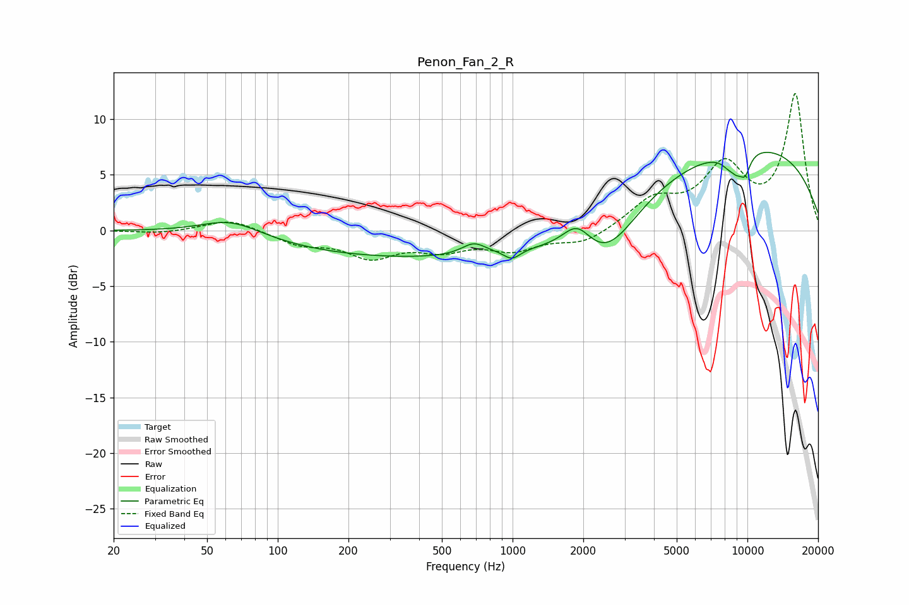

# Penon_Fan_2_R
See [usage instructions](https://github.com/jaakkopasanen/AutoEq#usage) for more options and info.

### Parametric EQs
Apply preamp of -7.1 dB when using parametric equalizer.

|   # | Type    |   Fc (Hz) |    Q |   Gain (dB) |
|-----|---------|-----------|------|-------------|
|   1 | Peaking |        63 | 1.09 |         1.5 |
|   2 | Peaking |       467 | 0.19 |        -2.5 |
|   3 | Peaking |       684 | 2.74 |         1.1 |
|   4 | Peaking |       994 | 4.21 |        -0.8 |
|   5 | Peaking |      1884 | 2.31 |         2.3 |
|   6 | Peaking |      2503 | 1.11 |        -4   |
|   7 | Peaking |      8649 | 5.99 |         0.9 |
|   8 | Peaking |      8726 | 3.67 |        -2.6 |
|   9 | Peaking |      9778 | 5.46 |        -1.6 |
|  10 | Peaking |      9806 | 0.26 |         7.7 |

### Fixed Band EQs
When using fixed band (also called graphic) equalizer, apply preamp of **-12.4 dB** (if available) and set gains manually with these parameters.

|   # | Type    |   Fc (Hz) |    Q |   Gain (dB) |
|-----|---------|-----------|------|-------------|
|   1 | Peaking |        31 | 1.41 |        -0.3 |
|   2 | Peaking |        62 | 1.41 |         1.1 |
|   3 | Peaking |       125 | 1.41 |        -1.1 |
|   4 | Peaking |       250 | 1.41 |        -2.2 |
|   5 | Peaking |       500 | 1.41 |        -1.5 |
|   6 | Peaking |      1000 | 1.41 |        -1.6 |
|   7 | Peaking |      2000 | 1.41 |        -1.2 |
|   8 | Peaking |      4000 | 1.41 |         2.5 |
|   9 | Peaking |      8000 | 1.41 |         5.4 |
|  10 | Peaking |     16000 | 1.41 |        12.1 |

### Graphs

