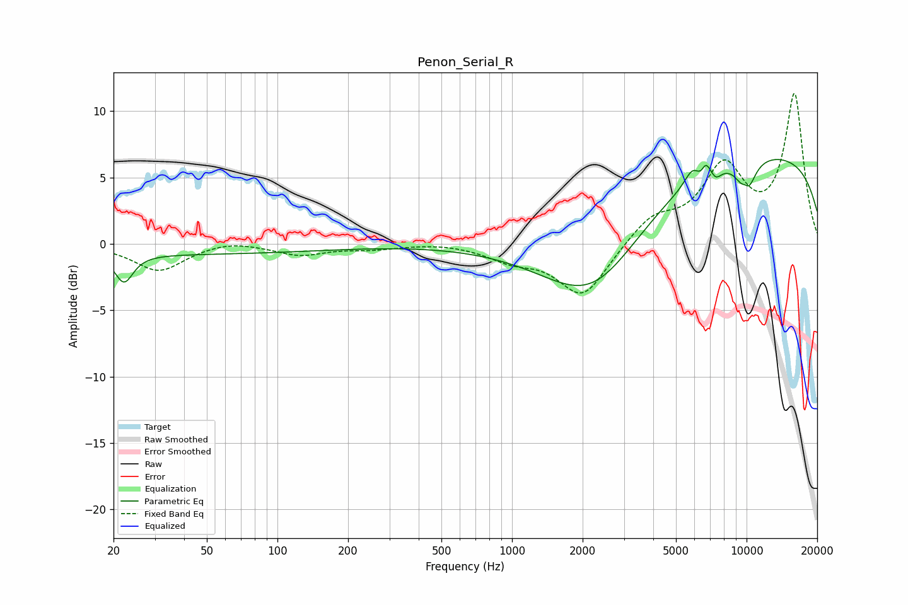

# Penon_Serial_R
See [usage instructions](https://github.com/jaakkopasanen/AutoEq#usage) for more options and info.

### Parametric EQs
Apply preamp of -6.5 dB when using parametric equalizer.

|   # | Type    |   Fc (Hz) |    Q |   Gain (dB) |
|-----|---------|-----------|------|-------------|
|   1 | Peaking |        22 | 3.78 |        -2.1 |
|   2 | Peaking |        33 | 0.18 |        -0.8 |
|   3 | Peaking |      2230 | 0.64 |        -6.5 |
|   4 | Peaking |      5886 | 4.09 |         1.1 |
|   5 | Peaking |      6467 | 5.83 |        -1.3 |
|   6 | Peaking |      6640 | 5.93 |         1.8 |
|   7 | Peaking |      7391 | 5.68 |        -0.7 |
|   8 | Peaking |      9880 | 5.96 |         1.4 |
|   9 | Peaking |      9946 | 3.6  |        -3.4 |
|  10 | Peaking |     10000 | 0.18 |         7   |

### Fixed Band EQs
When using fixed band (also called graphic) equalizer, apply preamp of **-11.4 dB** (if available) and set gains manually with these parameters.

|   # | Type    |   Fc (Hz) |    Q |   Gain (dB) |
|-----|---------|-----------|------|-------------|
|   1 | Peaking |        31 | 1.41 |        -2   |
|   2 | Peaking |        62 | 1.41 |         0.4 |
|   3 | Peaking |       125 | 1.41 |        -0.8 |
|   4 | Peaking |       250 | 1.41 |        -0.3 |
|   5 | Peaking |       500 | 1.41 |         0.1 |
|   6 | Peaking |      1000 | 1.41 |        -1   |
|   7 | Peaking |      2000 | 1.41 |        -4   |
|   8 | Peaking |      4000 | 1.41 |         1.9 |
|   9 | Peaking |      8000 | 1.41 |         5.5 |
|  10 | Peaking |     16000 | 1.41 |        11.1 |

### Graphs

