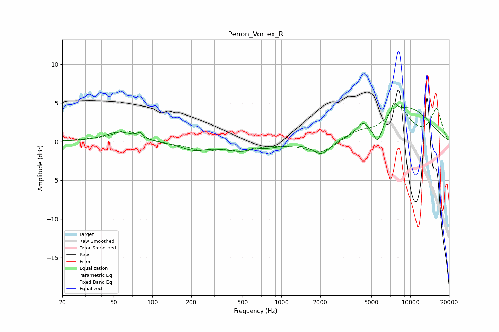

# Penon_Vortex_R
See [usage instructions](https://github.com/jaakkopasanen/AutoEq#usage) for more options and info.

### Parametric EQs
Apply preamp of -5.1 dB when using parametric equalizer.

|   # | Type    |   Fc (Hz) |    Q |   Gain (dB) |
|-----|---------|-----------|------|-------------|
|   1 | Peaking |        55 | 1.33 |         1.3 |
|   2 | Peaking |        80 | 6    |         0.7 |
|   3 | Peaking |       208 | 1.44 |        -0.9 |
|   4 | Peaking |       546 | 0.87 |        -1.4 |
|   5 | Peaking |       616 | 3.5  |         0.5 |
|   6 | Peaking |      2051 | 2    |        -1.8 |
|   7 | Peaking |      4280 | 3.67 |         1.1 |
|   8 | Peaking |      5588 | 3.99 |        -2.7 |
|   9 | Peaking |      7491 | 5.91 |         1.4 |
|  10 | Peaking |      9383 | 0.57 |         4.4 |

### Fixed Band EQs
When using fixed band (also called graphic) equalizer, apply preamp of **-4.7 dB** (if available) and set gains manually with these parameters.

|   # | Type    |   Fc (Hz) |    Q |   Gain (dB) |
|-----|---------|-----------|------|-------------|
|   1 | Peaking |        31 | 1.41 |         0.2 |
|   2 | Peaking |        62 | 1.41 |         1.4 |
|   3 | Peaking |       125 | 1.41 |        -0.3 |
|   4 | Peaking |       250 | 1.41 |        -1   |
|   5 | Peaking |       500 | 1.41 |        -1   |
|   6 | Peaking |      1000 | 1.41 |        -0.2 |
|   7 | Peaking |      2000 | 1.41 |        -1.6 |
|   8 | Peaking |      4000 | 1.41 |         1.1 |
|   9 | Peaking |      8000 | 1.41 |         4.3 |
|  10 | Peaking |     16000 | 1.41 |         4.1 |

### Graphs

