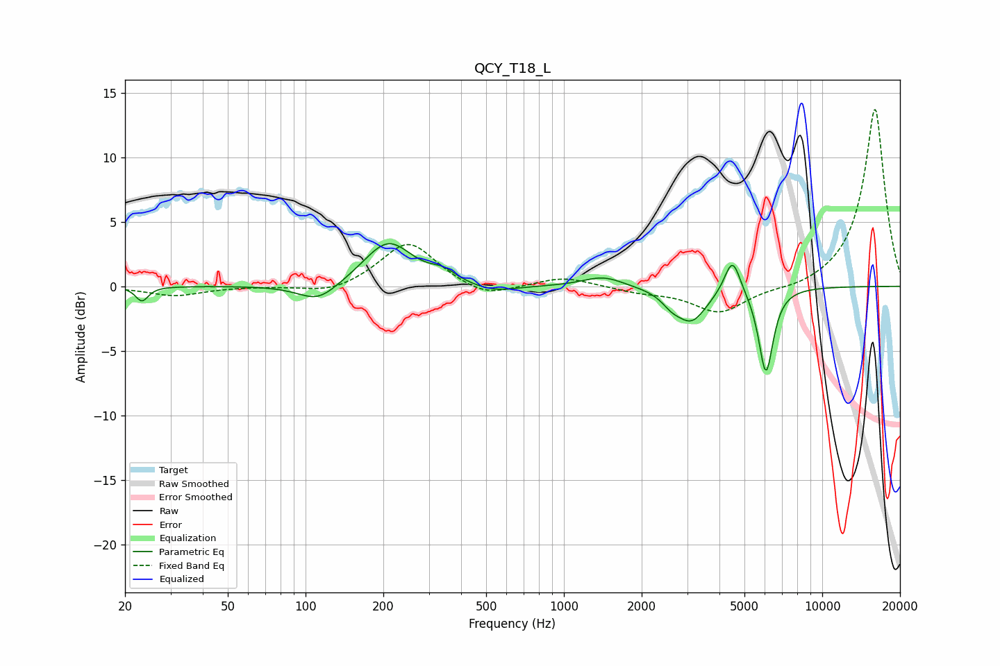

# QCY_T18_L
See [usage instructions](https://github.com/jaakkopasanen/AutoEq#usage) for more options and info.

### Parametric EQs
Apply preamp of -3.4 dB when using parametric equalizer.

|   # | Type    |   Fc (Hz) |    Q |   Gain (dB) |
|-----|---------|-----------|------|-------------|
|   1 | Peaking |        23 | 6    |        -1.1 |
|   2 | Peaking |       112 | 1.81 |        -1.5 |
|   3 | Peaking |       209 | 1.5  |         3.5 |
|   4 | Peaking |       341 | 2.93 |         0.7 |
|   5 | Peaking |       534 | 1.56 |        -0.6 |
|   6 | Peaking |      1421 | 1.82 |         0.8 |
|   7 | Peaking |      2610 | 3.83 |        -0.7 |
|   8 | Peaking |      3119 | 2.34 |        -2.6 |
|   9 | Peaking |      4491 | 4.52 |         2.8 |
|  10 | Peaking |      6053 | 4.87 |        -6.6 |

### Fixed Band EQs
When using fixed band (also called graphic) equalizer, apply preamp of **-13.8 dB** (if available) and set gains manually with these parameters.

|   # | Type    |   Fc (Hz) |    Q |   Gain (dB) |
|-----|---------|-----------|------|-------------|
|   1 | Peaking |        31 | 1.41 |        -0.7 |
|   2 | Peaking |        62 | 1.41 |        -0   |
|   3 | Peaking |       125 | 1.41 |        -0.6 |
|   4 | Peaking |       250 | 1.41 |         3.5 |
|   5 | Peaking |       500 | 1.41 |        -1   |
|   6 | Peaking |      1000 | 1.41 |         0.8 |
|   7 | Peaking |      2000 | 1.41 |        -0.4 |
|   8 | Peaking |      4000 | 1.41 |        -2.1 |
|   9 | Peaking |      8000 | 1.41 |        -0.3 |
|  10 | Peaking |     16000 | 1.41 |        13.8 |

### Graphs

