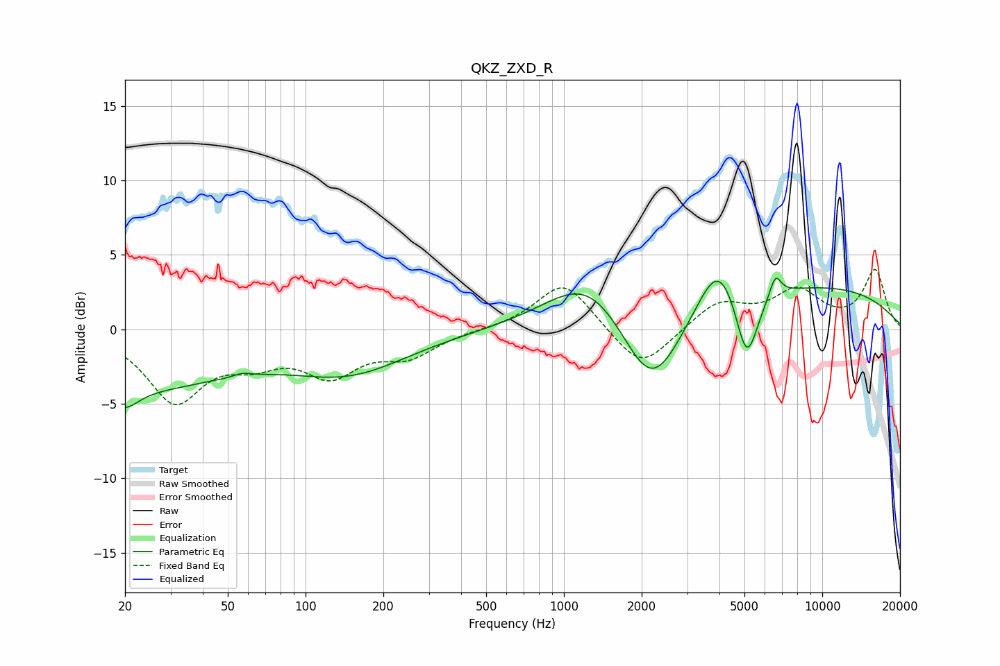

# QKZ_ZXD_R
See [usage instructions](https://github.com/jaakkopasanen/AutoEq#usage) for more options and info.

### Parametric EQs
Apply preamp of -3.5 dB when using parametric equalizer.

|   # | Type    |   Fc (Hz) |    Q |   Gain (dB) |
|-----|---------|-----------|------|-------------|
|   1 | Peaking |        20 | 2.81 |        -1.2 |
|   2 | Peaking |        20 | 0.34 |        -3.9 |
|   3 | Peaking |        57 | 4.68 |         0.2 |
|   4 | Peaking |       148 | 0.61 |        -2.6 |
|   5 | Peaking |      1252 | 0.87 |         3.7 |
|   6 | Peaking |      2183 | 1.19 |        -5.9 |
|   7 | Peaking |      3960 | 1.76 |         3.7 |
|   8 | Peaking |      5106 | 3.14 |        -5   |
|   9 | Peaking |      6587 | 5.97 |         1.5 |
|  10 | Peaking |      8934 | 0.28 |         2.9 |

### Fixed Band EQs
When using fixed band (also called graphic) equalizer, apply preamp of **-4.1 dB** (if available) and set gains manually with these parameters.

|   # | Type    |   Fc (Hz) |    Q |   Gain (dB) |
|-----|---------|-----------|------|-------------|
|   1 | Peaking |        31 | 1.41 |        -4.7 |
|   2 | Peaking |        62 | 1.41 |        -1.6 |
|   3 | Peaking |       125 | 1.41 |        -2.7 |
|   4 | Peaking |       250 | 1.41 |        -1.6 |
|   5 | Peaking |       500 | 1.41 |        -0   |
|   6 | Peaking |      1000 | 1.41 |         3.3 |
|   7 | Peaking |      2000 | 1.41 |        -2.9 |
|   8 | Peaking |      4000 | 1.41 |         1.8 |
|   9 | Peaking |      8000 | 1.41 |         2.4 |
|  10 | Peaking |     16000 | 1.41 |         3.9 |

### Graphs

