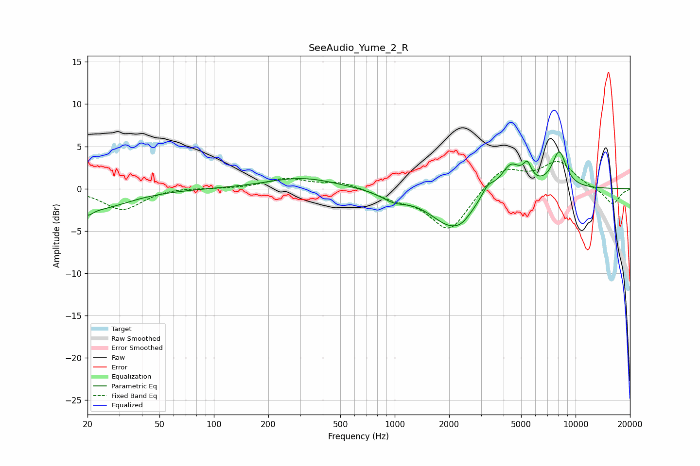

# SeeAudio_Yume_2_R
See [usage instructions](https://github.com/jaakkopasanen/AutoEq#usage) for more options and info.

### Parametric EQs
Apply preamp of -4.4 dB when using parametric equalizer.

|   # | Type    |   Fc (Hz) |    Q |   Gain (dB) |
|-----|---------|-----------|------|-------------|
|   1 | Peaking |        20 | 4.94 |        -1   |
|   2 | Peaking |        23 | 0.82 |        -2.3 |
|   3 | Peaking |       307 | 0.75 |         1.3 |
|   4 | Peaking |       989 | 1.96 |        -1   |
|   5 | Peaking |      2078 | 1.16 |        -4.4 |
|   6 | Peaking |      2350 | 3.67 |        -0.4 |
|   7 | Peaking |      3269 | 3.89 |         1.3 |
|   8 | Peaking |      4385 | 2.46 |         3.2 |
|   9 | Peaking |      5412 | 5.98 |         1.9 |
|  10 | Peaking |      8121 | 3.34 |         4.3 |

### Fixed Band EQs
When using fixed band (also called graphic) equalizer, apply preamp of **-3.3 dB** (if available) and set gains manually with these parameters.

|   # | Type    |   Fc (Hz) |    Q |   Gain (dB) |
|-----|---------|-----------|------|-------------|
|   1 | Peaking |        31 | 1.41 |        -2.5 |
|   2 | Peaking |        62 | 1.41 |         0.2 |
|   3 | Peaking |       125 | 1.41 |        -0   |
|   4 | Peaking |       250 | 1.41 |         1.2 |
|   5 | Peaking |       500 | 1.41 |         0.8 |
|   6 | Peaking |      1000 | 1.41 |        -0.9 |
|   7 | Peaking |      2000 | 1.41 |        -5   |
|   8 | Peaking |      4000 | 1.41 |         2.6 |
|   9 | Peaking |      8000 | 1.41 |         3.1 |
|  10 | Peaking |     16000 | 1.41 |        -1.9 |

### Graphs

