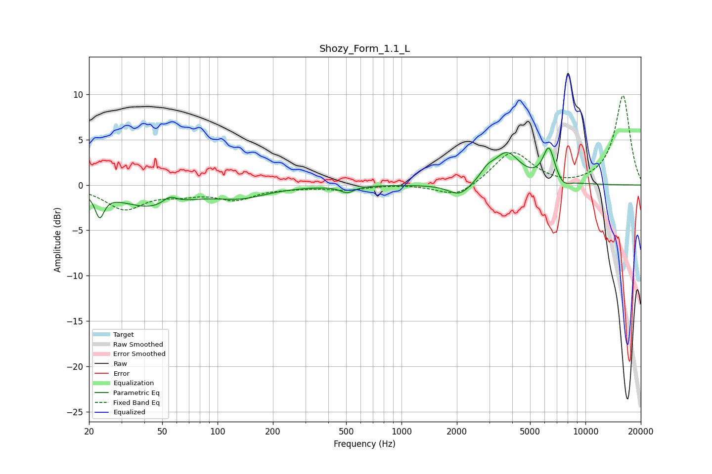

# Shozy_Form_1.1_L
See [usage instructions](https://github.com/jaakkopasanen/AutoEq#usage) for more options and info.

### Parametric EQs
Apply preamp of -4.1 dB when using parametric equalizer.

|   # | Type    |   Fc (Hz) |    Q |   Gain (dB) |
|-----|---------|-----------|------|-------------|
|   1 | Peaking |        23 | 5.9  |        -2.6 |
|   2 | Peaking |        43 | 0.81 |        -2.3 |
|   3 | Peaking |        55 | 3.66 |         0.9 |
|   4 | Peaking |       134 | 0.97 |        -1.2 |
|   5 | Peaking |       507 | 3.82 |        -0.7 |
|   6 | Peaking |      2074 | 2.25 |        -1.5 |
|   7 | Peaking |      2920 | 3.79 |         0.9 |
|   8 | Peaking |      3730 | 1.94 |         3.4 |
|   9 | Peaking |      6327 | 4.24 |         3.8 |
|  10 | Peaking |      7562 | 3.83 |        -0.8 |

### Fixed Band EQs
When using fixed band (also called graphic) equalizer, apply preamp of **-9.9 dB** (if available) and set gains manually with these parameters.

|   # | Type    |   Fc (Hz) |    Q |   Gain (dB) |
|-----|---------|-----------|------|-------------|
|   1 | Peaking |        31 | 1.41 |        -2.6 |
|   2 | Peaking |        62 | 1.41 |        -0.8 |
|   3 | Peaking |       125 | 1.41 |        -1.5 |
|   4 | Peaking |       250 | 1.41 |        -0.2 |
|   5 | Peaking |       500 | 1.41 |        -0.5 |
|   6 | Peaking |      1000 | 1.41 |         0.1 |
|   7 | Peaking |      2000 | 1.41 |        -1.5 |
|   8 | Peaking |      4000 | 1.41 |         3.7 |
|   9 | Peaking |      8000 | 1.41 |        -0.3 |
|  10 | Peaking |     16000 | 1.41 |         9.9 |

### Graphs

