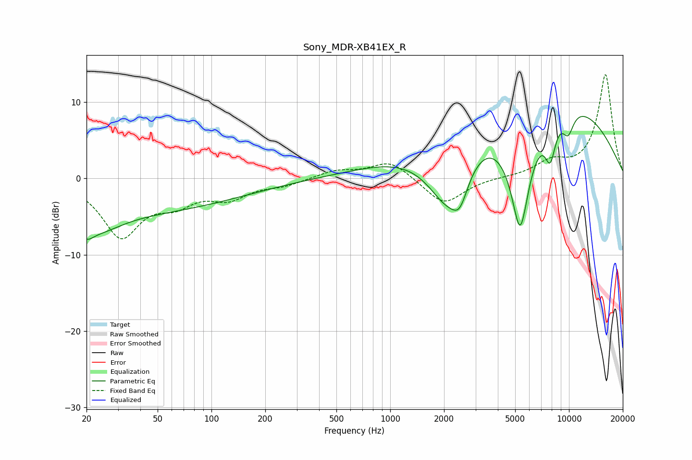

# Sony_MDR-XB41EX_R
See [usage instructions](https://github.com/jaakkopasanen/AutoEq#usage) for more options and info.

### Parametric EQs
Apply preamp of -8.2 dB when using parametric equalizer.

|   # | Type    |   Fc (Hz) |    Q |   Gain (dB) |
|-----|---------|-----------|------|-------------|
|   1 | Peaking |        20 | 4.01 |        -1.3 |
|   2 | Peaking |        23 | 1.07 |        -2.5 |
|   3 | Peaking |        29 | 0.18 |        -4.4 |
|   4 | Peaking |      2097 | 1.06 |       -10.2 |
|   5 | Peaking |      2453 | 3.13 |        -3.4 |
|   6 | Peaking |      5332 | 1.99 |       -17.7 |
|   7 | Peaking |      5604 | 0.25 |        12.4 |
|   8 | Peaking |      6722 | 0.27 |         1.4 |
|   9 | Peaking |      7859 | 4.28 |        -5   |
|  10 | Peaking |      9887 | 3.8  |        -3   |

### Fixed Band EQs
When using fixed band (also called graphic) equalizer, apply preamp of **-13.7 dB** (if available) and set gains manually with these parameters.

|   # | Type    |   Fc (Hz) |    Q |   Gain (dB) |
|-----|---------|-----------|------|-------------|
|   1 | Peaking |        31 | 1.41 |        -7.4 |
|   2 | Peaking |        62 | 1.41 |        -2.6 |
|   3 | Peaking |       125 | 1.41 |        -2.3 |
|   4 | Peaking |       250 | 1.41 |        -0.8 |
|   5 | Peaking |       500 | 1.41 |         1   |
|   6 | Peaking |      1000 | 1.41 |         2.3 |
|   7 | Peaking |      2000 | 1.41 |        -3.5 |
|   8 | Peaking |      4000 | 1.41 |         0.1 |
|   9 | Peaking |      8000 | 1.41 |         1.9 |
|  10 | Peaking |     16000 | 1.41 |        13.6 |

### Graphs

