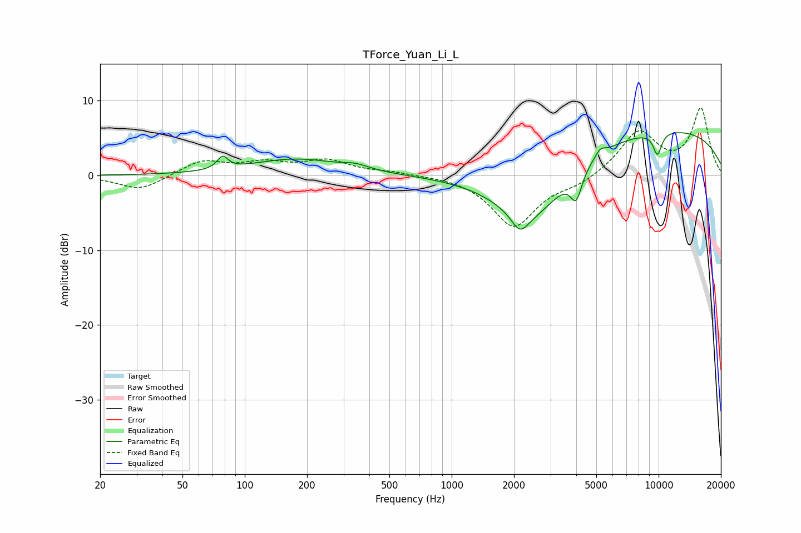

# TForce_Yuan_Li_L
See [usage instructions](https://github.com/jaakkopasanen/AutoEq#usage) for more options and info.

### Parametric EQs
Apply preamp of -5.8 dB when using parametric equalizer.

|   # | Type    |   Fc (Hz) |    Q |   Gain (dB) |
|-----|---------|-----------|------|-------------|
|   1 | Peaking |        78 | 5.61 |         1.7 |
|   2 | Peaking |       176 | 0.64 |         2.2 |
|   3 | Peaking |       344 | 2.29 |         0.6 |
|   4 | Peaking |      2135 | 3.58 |        -2.3 |
|   5 | Peaking |      2427 | 0.77 |        -8.9 |
|   6 | Peaking |      3998 | 5.17 |        -3.7 |
|   7 | Peaking |      5223 | 5.77 |         1   |
|   8 | Peaking |      8743 | 0.2  |         6.6 |
|   9 | Peaking |      9774 | 5.95 |        -0.6 |
|  10 | Peaking |      9897 | 5.99 |        -2.3 |

### Fixed Band EQs
When using fixed band (also called graphic) equalizer, apply preamp of **-9.2 dB** (if available) and set gains manually with these parameters.

|   # | Type    |   Fc (Hz) |    Q |   Gain (dB) |
|-----|---------|-----------|------|-------------|
|   1 | Peaking |        31 | 1.41 |        -2   |
|   2 | Peaking |        62 | 1.41 |         2   |
|   3 | Peaking |       125 | 1.41 |         1.5 |
|   4 | Peaking |       250 | 1.41 |         1.9 |
|   5 | Peaking |       500 | 1.41 |         0.4 |
|   6 | Peaking |      1000 | 1.41 |         0.1 |
|   7 | Peaking |      2000 | 1.41 |        -6.8 |
|   8 | Peaking |      4000 | 1.41 |        -1.1 |
|   9 | Peaking |      8000 | 1.41 |         5.8 |
|  10 | Peaking |     16000 | 1.41 |         8.8 |

### Graphs

