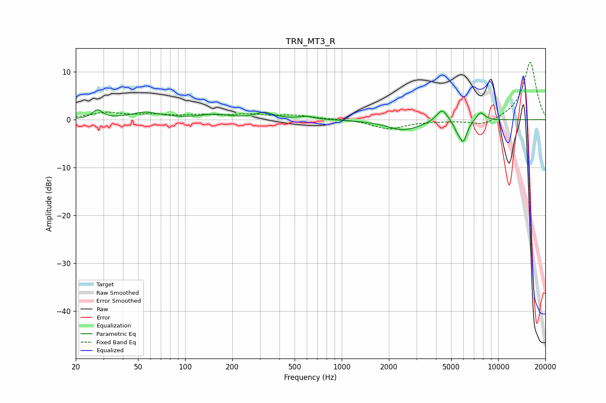

# TRN_MT3_R
See [usage instructions](https://github.com/jaakkopasanen/AutoEq#usage) for more options and info.

### Parametric EQs
Apply preamp of -2.2 dB when using parametric equalizer.

|   # | Type    |   Fc (Hz) |    Q |   Gain (dB) |
|-----|---------|-----------|------|-------------|
|   1 | Peaking |        27 | 4.68 |         1.8 |
|   2 | Peaking |        56 | 1.46 |         1.5 |
|   3 | Peaking |       155 | 1.52 |         1   |
|   4 | Peaking |       321 | 2.54 |         1.4 |
|   5 | Peaking |       590 | 2.72 |         0.6 |
|   6 | Peaking |      2490 | 1.32 |        -2.2 |
|   7 | Peaking |      4378 | 3.91 |         2.7 |
|   8 | Peaking |      5477 | 6    |        -1.4 |
|   9 | Peaking |      5982 | 5.52 |        -4.2 |
|  10 | Peaking |      7697 | 4.71 |         1.8 |

### Fixed Band EQs
When using fixed band (also called graphic) equalizer, apply preamp of **-12.1 dB** (if available) and set gains manually with these parameters.

|   # | Type    |   Fc (Hz) |    Q |   Gain (dB) |
|-----|---------|-----------|------|-------------|
|   1 | Peaking |        31 | 1.41 |         1.4 |
|   2 | Peaking |        62 | 1.41 |         0.8 |
|   3 | Peaking |       125 | 1.41 |         0.8 |
|   4 | Peaking |       250 | 1.41 |         1   |
|   5 | Peaking |       500 | 1.41 |         0.8 |
|   6 | Peaking |      1000 | 1.41 |         0.1 |
|   7 | Peaking |      2000 | 1.41 |        -1.9 |
|   8 | Peaking |      4000 | 1.41 |        -0.2 |
|   9 | Peaking |      8000 | 1.41 |        -1.4 |
|  10 | Peaking |     16000 | 1.41 |        12.1 |

### Graphs

