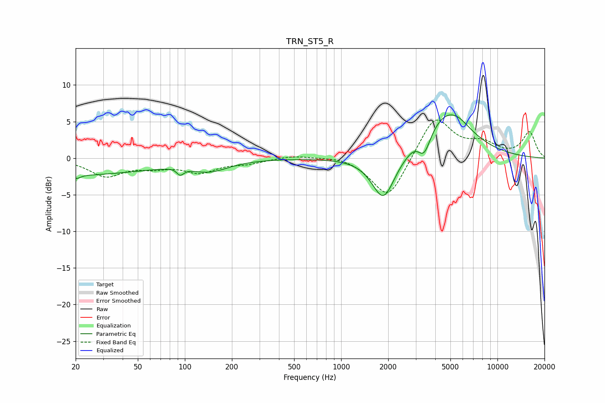

# TRN_ST5_R
See [usage instructions](https://github.com/jaakkopasanen/AutoEq#usage) for more options and info.

### Parametric EQs
Apply preamp of -6.0 dB when using parametric equalizer.

|   # | Type    |   Fc (Hz) |    Q |   Gain (dB) |
|-----|---------|-----------|------|-------------|
|   1 | Peaking |        20 | 5.73 |        -0.5 |
|   2 | Peaking |        20 | 0.3  |        -2.2 |
|   3 | Peaking |        92 | 4.33 |         1.5 |
|   4 | Peaking |        93 | 5.22 |        -2.3 |
|   5 | Peaking |       144 | 1.16 |        -1.5 |
|   6 | Peaking |      1865 | 1.91 |        -6.2 |
|   7 | Peaking |      2934 | 3.36 |         0.5 |
|   8 | Peaking |      3402 | 3.61 |        -2.7 |
|   9 | Peaking |      4795 | 0.94 |         6.3 |
|  10 | Peaking |      5742 | 2.81 |         0.3 |

### Fixed Band EQs
When using fixed band (also called graphic) equalizer, apply preamp of **-5.3 dB** (if available) and set gains manually with these parameters.

|   # | Type    |   Fc (Hz) |    Q |   Gain (dB) |
|-----|---------|-----------|------|-------------|
|   1 | Peaking |        31 | 1.41 |        -2.3 |
|   2 | Peaking |        62 | 1.41 |        -1   |
|   3 | Peaking |       125 | 1.41 |        -1.8 |
|   4 | Peaking |       250 | 1.41 |        -0.6 |
|   5 | Peaking |       500 | 1.41 |         0.4 |
|   6 | Peaking |      1000 | 1.41 |         0.4 |
|   7 | Peaking |      2000 | 1.41 |        -5.8 |
|   8 | Peaking |      4000 | 1.41 |         5.9 |
|   9 | Peaking |      8000 | 1.41 |         1.7 |
|  10 | Peaking |     16000 | 1.41 |         3.5 |

### Graphs

