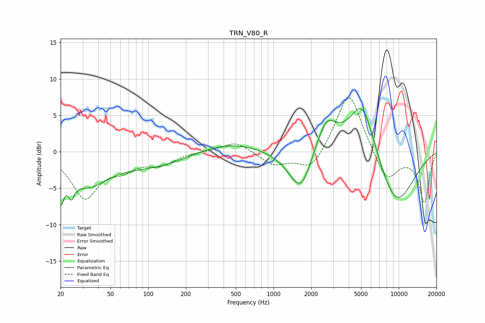

# TRN_V80_R
See [usage instructions](https://github.com/jaakkopasanen/AutoEq#usage) for more options and info.

### Parametric EQs
Apply preamp of -6.0 dB when using parametric equalizer.

|   # | Type    |   Fc (Hz) |    Q |   Gain (dB) |
|-----|---------|-----------|------|-------------|
|   1 | Peaking |        20 | 5.65 |        -4.3 |
|   2 | Peaking |        24 | 5.76 |        -2.2 |
|   3 | Peaking |        32 | 0.84 |        -4.2 |
|   4 | Peaking |       113 | 0.52 |        -1.8 |
|   5 | Peaking |       436 | 0.57 |         1.4 |
|   6 | Peaking |      1611 | 1.4  |        -5   |
|   7 | Peaking |      1708 | 2.62 |        -1.1 |
|   8 | Peaking |      2636 | 1.76 |         4.6 |
|   9 | Peaking |      5121 | 1.27 |         8.6 |
|  10 | Peaking |      9366 | 0.79 |        -7.9 |

### Fixed Band EQs
When using fixed band (also called graphic) equalizer, apply preamp of **-7.5 dB** (if available) and set gains manually with these parameters.

|   # | Type    |   Fc (Hz) |    Q |   Gain (dB) |
|-----|---------|-----------|------|-------------|
|   1 | Peaking |        31 | 1.41 |        -6.1 |
|   2 | Peaking |        62 | 1.41 |        -1.8 |
|   3 | Peaking |       125 | 1.41 |        -1.6 |
|   4 | Peaking |       250 | 1.41 |         0.1 |
|   5 | Peaking |       500 | 1.41 |         1.5 |
|   6 | Peaking |      1000 | 1.41 |        -1.8 |
|   7 | Peaking |      2000 | 1.41 |        -2.8 |
|   8 | Peaking |      4000 | 1.41 |         8.6 |
|   9 | Peaking |      8000 | 1.41 |        -4.2 |
|  10 | Peaking |     16000 | 1.41 |        -6.9 |

### Graphs

