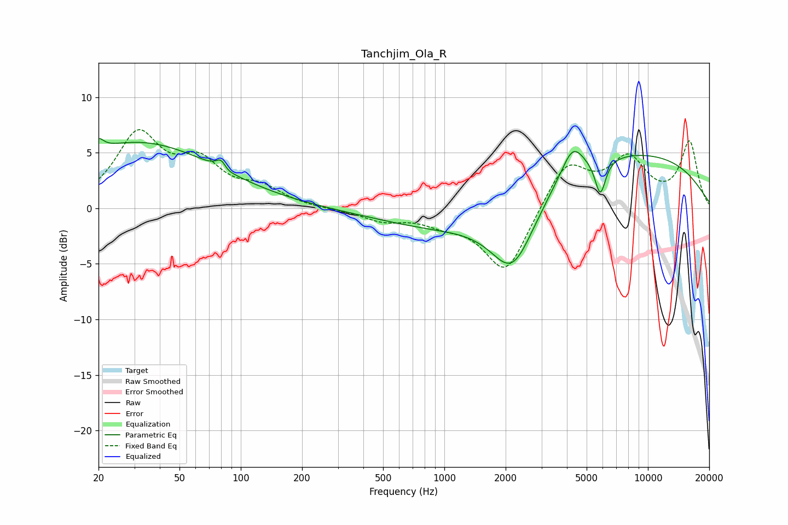

# Tanchjim_Ola_R
See [usage instructions](https://github.com/jaakkopasanen/AutoEq#usage) for more options and info.

### Parametric EQs
Apply preamp of -6.4 dB when using parametric equalizer.

|   # | Type    |   Fc (Hz) |    Q |   Gain (dB) |
|-----|---------|-----------|------|-------------|
|   1 | Peaking |        20 | 5.82 |         1   |
|   2 | Peaking |        31 | 0.36 |         5.9 |
|   3 | Peaking |        80 | 5.98 |         0.9 |
|   4 | Peaking |        86 | 5.52 |        -0.2 |
|   5 | Peaking |      1229 | 0.4  |        -2.3 |
|   6 | Peaking |      2167 | 1.31 |        -6.2 |
|   7 | Peaking |      3468 | 3.58 |         0.1 |
|   8 | Peaking |      4266 | 2.61 |         2.7 |
|   9 | Peaking |      5836 | 5.25 |        -3.2 |
|  10 | Peaking |      7323 | 0.24 |         5.2 |

### Fixed Band EQs
When using fixed band (also called graphic) equalizer, apply preamp of **-7.2 dB** (if available) and set gains manually with these parameters.

|   # | Type    |   Fc (Hz) |    Q |   Gain (dB) |
|-----|---------|-----------|------|-------------|
|   1 | Peaking |        31 | 1.41 |         6.4 |
|   2 | Peaking |        62 | 1.41 |         3.5 |
|   3 | Peaking |       125 | 1.41 |         1.5 |
|   4 | Peaking |       250 | 1.41 |        -0.1 |
|   5 | Peaking |       500 | 1.41 |        -1   |
|   6 | Peaking |      1000 | 1.41 |        -1   |
|   7 | Peaking |      2000 | 1.41 |        -5.9 |
|   8 | Peaking |      4000 | 1.41 |         4.2 |
|   9 | Peaking |      8000 | 1.41 |         4.1 |
|  10 | Peaking |     16000 | 1.41 |         5.9 |

### Graphs

