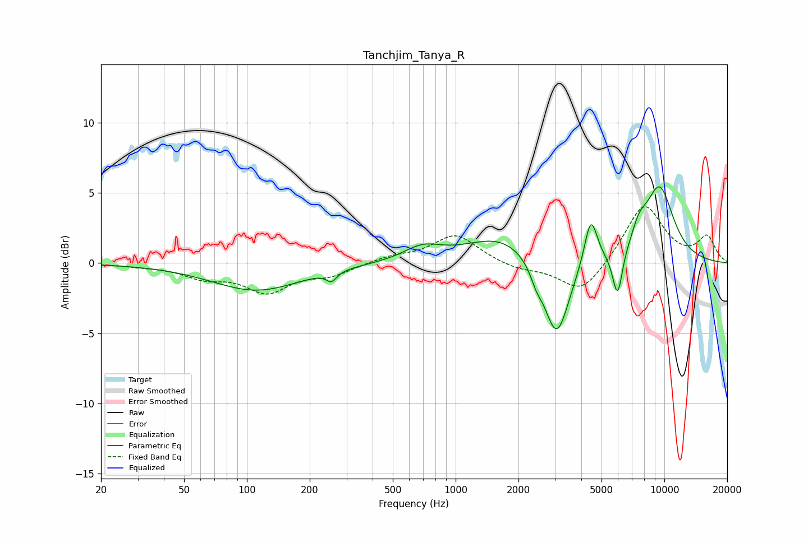

# Tanchjim_Tanya_R
See [usage instructions](https://github.com/jaakkopasanen/AutoEq#usage) for more options and info.

### Parametric EQs
Apply preamp of -5.5 dB when using parametric equalizer.

|   # | Type    |   Fc (Hz) |    Q |   Gain (dB) |
|-----|---------|-----------|------|-------------|
|   1 | Peaking |       111 | 0.66 |        -1.9 |
|   2 | Peaking |       254 | 5.78 |        -0.7 |
|   3 | Peaking |       693 | 1.55 |         1   |
|   4 | Peaking |      1674 | 0.83 |         1.9 |
|   5 | Peaking |      2434 | 5.21 |        -0.8 |
|   6 | Peaking |      3043 | 2.29 |        -5.9 |
|   7 | Peaking |      4444 | 4.5  |         3.4 |
|   8 | Peaking |      5968 | 5.77 |        -3.3 |
|   9 | Peaking |      7575 | 3.59 |         1.3 |
|  10 | Peaking |      9469 | 1.76 |         5.3 |

### Fixed Band EQs
When using fixed band (also called graphic) equalizer, apply preamp of **-4.1 dB** (if available) and set gains manually with these parameters.

|   # | Type    |   Fc (Hz) |    Q |   Gain (dB) |
|-----|---------|-----------|------|-------------|
|   1 | Peaking |        31 | 1.41 |        -0.1 |
|   2 | Peaking |        62 | 1.41 |        -0.9 |
|   3 | Peaking |       125 | 1.41 |        -1.9 |
|   4 | Peaking |       250 | 1.41 |        -0.8 |
|   5 | Peaking |       500 | 1.41 |         0.4 |
|   6 | Peaking |      1000 | 1.41 |         2   |
|   7 | Peaking |      2000 | 1.41 |        -0.5 |
|   8 | Peaking |      4000 | 1.41 |        -2.2 |
|   9 | Peaking |      8000 | 1.41 |         4.2 |
|  10 | Peaking |     16000 | 1.41 |         1.8 |

### Graphs

