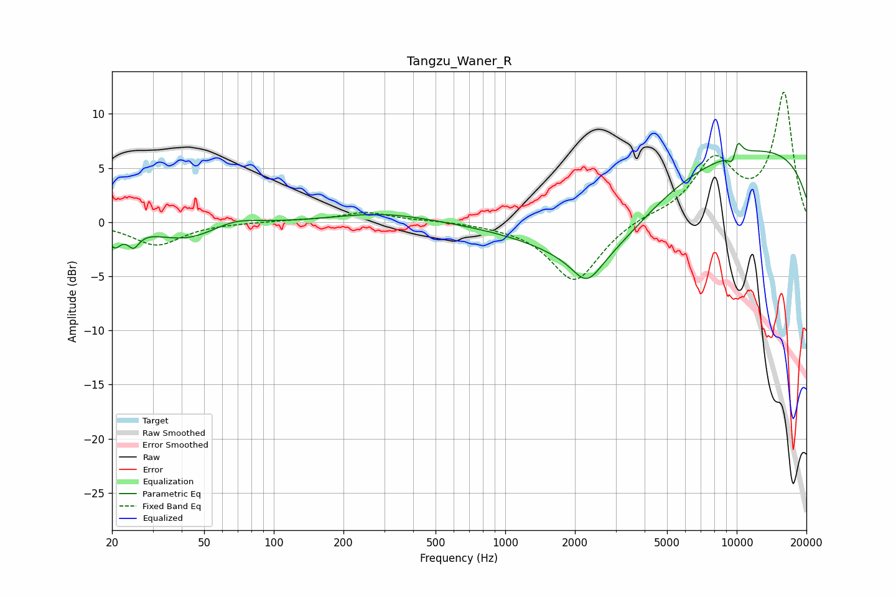

# Tangzu_Waner_R
See [usage instructions](https://github.com/jaakkopasanen/AutoEq#usage) for more options and info.

### Parametric EQs
Apply preamp of -7.4 dB when using parametric equalizer.

|   # | Type    |   Fc (Hz) |    Q |   Gain (dB) |
|-----|---------|-----------|------|-------------|
|   1 | Peaking |        20 | 5.21 |        -1.7 |
|   2 | Peaking |        25 | 5.71 |        -1.4 |
|   3 | Peaking |        42 | 0.98 |        -1.6 |
|   4 | Peaking |        67 | 1.46 |         0.8 |
|   5 | Peaking |       296 | 0.69 |         0.9 |
|   6 | Peaking |      2251 | 2.32 |        -2.4 |
|   7 | Peaking |      2569 | 0.56 |        -7.1 |
|   8 | Peaking |      9425 | 0.18 |         7.3 |
|   9 | Peaking |      9725 | 5.96 |        -2.3 |
|  10 | Peaking |     10000 | 6    |         2.7 |

### Fixed Band EQs
When using fixed band (also called graphic) equalizer, apply preamp of **-12.1 dB** (if available) and set gains manually with these parameters.

|   # | Type    |   Fc (Hz) |    Q |   Gain (dB) |
|-----|---------|-----------|------|-------------|
|   1 | Peaking |        31 | 1.41 |        -2.1 |
|   2 | Peaking |        62 | 1.41 |        -0   |
|   3 | Peaking |       125 | 1.41 |         0.1 |
|   4 | Peaking |       250 | 1.41 |         0.9 |
|   5 | Peaking |       500 | 1.41 |         0.1 |
|   6 | Peaking |      1000 | 1.41 |        -0.2 |
|   7 | Peaking |      2000 | 1.41 |        -5.5 |
|   8 | Peaking |      4000 | 1.41 |         0.5 |
|   9 | Peaking |      8000 | 1.41 |         5.5 |
|  10 | Peaking |     16000 | 1.41 |        11.8 |

### Graphs

